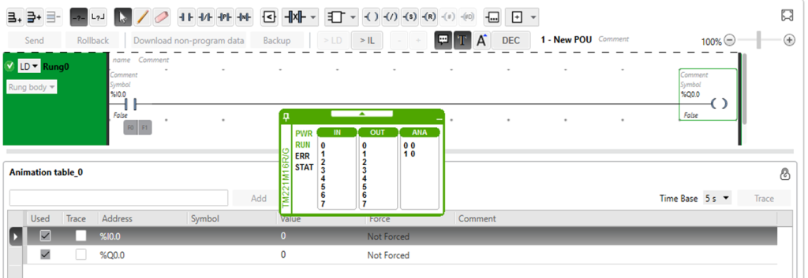
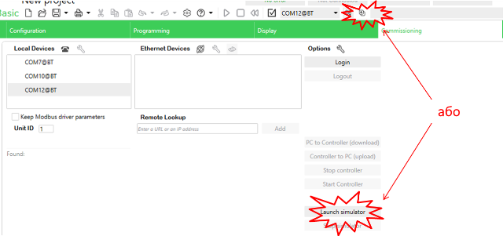
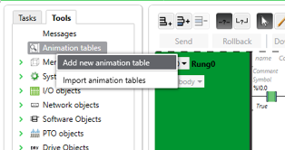
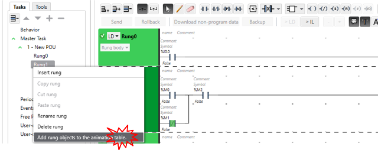
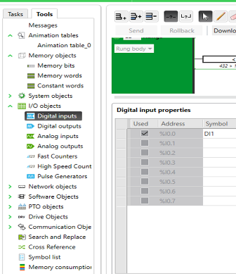

| [<- до лаборних робіт](README.md) | [на основну сторінку курсу](../README.md) |
| --------------------------------- | ----------------------------------------- |
|                                   |                                           |

# Лабораторна робота 2. Робота з LD (Ladder Diagram).

## 1. Перевірка роботи базових компонентів.

###### 1.1. Створення та збереження проекту

- Запустіть Machine Expert - Basic
- збережіть проект

###### 1.2. Робота з Rung

- перейдіть на вкладку Programming 
- перейдіть у розділ `Tasks` лівої бічної панелі

-  [ознайомтеся з додатком, в якому описані основні зображення та повденіка елментів LD](lab2_ann1.md) 
- пошукайте елементи, які описані в додатку на бічній панелі

###### 1.3. Створення програми одним НР(нормально розімкнутим) контактом та однією НР котушкою.

- створіть програму, яка наведена на рисунку 1

рис.1.

###### 1.4. Компіляція програми 

Зробіть компіляцію програми

###### 1.5. Запуск імітатора ПЛК

- Перейдіть на вкладку Commisioning і запустіть імітатор ПЛК  

- запустіть програму в ПЛК на виконання

  

- у вікні, яке з'явиться зробіть підтвердження

###### 1.6. Створення таблиці послідовності перевірки

Для перевірки програми, що наведена на рисунку 1 створимо таблицю послідовності, в якій вкажемо як має перевірятися програма, і які очікувані значення. 

Таблиця 1.1. Послідовність перевірки програми користувача

| Крок | %I0.0  (змінювати) | %Q0.0  (змінюватиметься на) | Примітка                |
| ---- | ----------------------- | -------------------------------- | ----------------------- |
| 1    | 0                       | 0                                | після запуску програми  |
| 2    | 1                       | 1                                | %Q0.0 стає рівною 1     |
| 3    | 0                       | 0                                | %Q0.0 повертається до 0 |

###### 1.7. Перевірка програми з використанням вікна імітатора

- познайомтеся зі змістом вікна керування імітатором ПЛК

- натисніть на 0-й вхід і подивіться на стан 0-го виходу, зелений колір показує на стан `ВКЛ`, чорний - `ВИКЛ`; 

- зауважте, що стан входів можна змінювати тільки в імітаторі; для реального ПЛК стан вхідних змінних повністю залежить від входів ПЛК, або їх можна форсувати;   

- перейдіть на вікно "programming" редактору, на ньому в онлайні повинні підсвічуватися стани контактів

  

-  перевірте роботу програми відповідно до послідовності, вказаної в таблиці 1.1 

###### 1.8. Перевірка програми з використанням таблиці анімації

- створіть нову таблицю анімації

- добавте в таблицю анімації змінну `%I0.0` та `%Q0.0`

  

- оскільки з таблиці анімації не можна змінювати вхідні змінні, перевірте роботу програми шляхом форсування в 0 та в 1

- скиньте режим форсування в `Not Forced`   

###### 1.9. Перевірка програми з використанням вбудованих засобів редактору LD  

- підведіть вказівник миші до контакту, там з'являться команди `F0` та `F1`

  

-  перевірте як працюють команди  `F0` та `F1`

###### 1.10. Програма з паралельним та послідовним з'єднанням, використання НЗ (нормально-замкнутого) контакту 

- не зупиняючи програму добавте ще один rung з наступним змістом 

- він буде мати помаранчовий колір, що значитиме, що його немає наразі в ПЛК (вірніше його імітаторі); після внесення всіх змін, натисніть `Send` 

  

- добавте усі об'єкти з даного rung в таблицю анімацій 

- заповніть наступну таблицю очікуваними значеннями `%M100`

| Крок | %M0  | %M1  | %M2  | %M100 | Примітка |
| ---- | ---- | ---- | ---- | ----- | -------- |
| 1    | 0    | 0    | 0    |       |          |
| 2    | 1    | 0    | 0    |       |          |
| 3    | 0    | 1    | 0    |       |          |
| 4    | 0    | 0    | 1    |       |          |
| 5    | 1    | 1    | 1    |       |          |

- з використанням таблиці анімацій перевірте чи дійсно програма працює так, як очікувалося, якщо ні подумайте чому і напишіть в примітках

###### 1.11. Програма з котушками (/), (S) та (R) 

- використовуючи таблицю анімацій обнуліть зімнні `%M0` та  `%M1` 
- не зупиняючи програму добавте ще один rung з наступним змістом 

- добавте усі об'єкти з даного rung в таблицю анімацій 
- заповніть наступну таблицю очікуваними значеннями `%M101` та `%M102`

| Крок | %M0  | %M1  | %M101 | %M102 | Примітка |
| ---- | ---- | ---- | ----- | ----- | -------- |
| 1    | 0    | 0    |       |       |          |
| 2    | 1    | 0    |       |       |          |
| 3    | 0    | 0    |       |       |          |
| 4    | 0    | 1    |       |       |          |
| 5    | 1    | 1    |       |       |          |
| 6    | 0    | 0    |       |       |          |

- з використанням таблиці анімацій перевірте чи дійсно програма працює так, як очікувалося, якщо ні подумайте чому і напишіть в примітках

###### 1.12. Програма з компаратором

- не зупиняючи програму добавте ще один rung з наступним змістом 

- заповніть наступну таблицю очікуваними значеннями `%Q0.2` 

  | Крок | %IW0.0 | %Q0.2 | Примітка |
  | ---- | ------ | ----- | -------- |
  | 1    | 0      |       |          |
  | 2    | 500    |       |          |
  | 3    | 2000   |       |          |
  | 4    | 5000   |       |          |
  | 5    | 500    |       |          |

- використовуючи вікно керування імітатором перевірте роботу фрагменту програми

###### 1.13. Програма з операційним блоком

- використовуючи таблицю анімацій обнуліть зімнну `%M0`
- не зупиняючи програму добавте ще один rung з наступним змістом 

- заповніть наступну таблицю очікуваними значеннями `%MW100` 

| Крок | %M0  | %MW100 | Примітка |
| ---- | ---- | ------ | -------- |
| 1    | 0    |        |          |
| 2    | 1    |        |          |
| 3    | 1    |        |          |
| 4    | 1    |        |          |
| 5    | 0    |        |          |

- поясніть поведінку змінної %MW100

###### 1.14. Створення символьних назв для змінних

- перейдіть на закладку `Tools` на бічній панелі 

- знайдіть усі використані змінні у Вашій програмі і надайте їм символьні імена, які починаються з 'Nm_', де  Nm - перші літери вашого прізвища 
- перейдіть у розділ`Symbol list` і знайдіть усі символи у переліку назв
- подивіться, як відображаються символьні імена в програмі

## 2. Приклад написання програми користувача.

## 3. Створення власної програми користувача.

