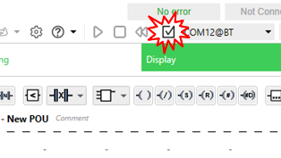
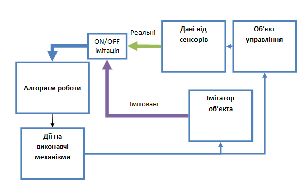
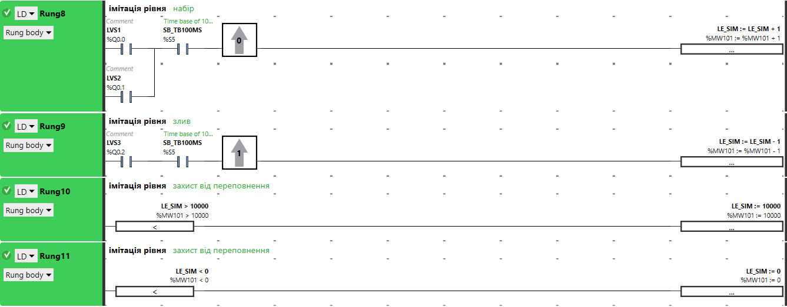

| [<- до лаборних робіт](README.md) | [на основну сторінку курсу](../README.md) |
| --------------------------------- | ----------------------------------------- |
|                                   |                                           |

# Лабораторна робота 3. Робота з функціональними блоками.

## 1. Перевірка роботи таймерів та лічильників.

###### 1.1. Створення та збереження проекту

- Запустіть Machine Expert - Basic
- збережіть проект

###### 1.2. Створення програми з таймером типу TON

- перейдіть на вкладку Programming 
- створіть програму, яка наведена на рисунку 1

рис.1.

###### 1.3. Компіляція програми 

Зробіть компіляцію програми

###### 1.4. Запуск імітатора ПЛК

- Перейдіть на вкладку Commisioning і запустіть імітатор ПЛК  

- запустіть програму в ПЛК на виконання

  

- у вікні, яке з'явиться зробіть підтвердження

###### 1.5. Перевірка програми

Аналогічно до послідовності, описаній у [лабораторній №2](lab2_LD.md), перевірте роботу програми за допомогою імітатора ПЛК та таблиці анімації.

Таблиця 1.1. Послідовність перевірки програми користувача

| Крок | %I0.0  (змінювати) | %Q0.0  (змінюватиметься на) | Примітка                |
| ---- | ----------------------- | -------------------------------- | ----------------------- |
| 1    | 0                       | 0                                | після запуску програми  |
| 2    | 1                       | 0-->1 (через 5 сек.)             | %Q0.0 стає рівною 1     |
| 3    | 0                       | 0                                | %Q0.0 повертається до 0 |

###### 1.6 Перевірка роботи таймерів типу TOF та TP

- Змініть тип таймера у вашій програмі на TOF
- Виконайте перевірку роботи програми, аналогічну п 1.5 .

Таблиця 1.2. Послідовність перевірки програми користувача

| Крок | %I0.0  (змінювати) | %Q0.0  (змінюватиметься на) | Примітка                |
| ---- | ----------------------- | -------------------------------- | ----------------------- |
| 1    | 0                       | 0                                | після запуску програми  |
| 2    | 1                       | 1                                | %Q0.0 стає рівною 1     |
| 3    | 0                       | 1-->0 (через 5 сек.)             | %Q0.0 повертається до 0 |

- Змініть тип таймера у вашій програмі на TP
- Виконайте перевірку роботи програми, аналогічну п 1.5 .

| Крок | %I0.0  (змінювати) | %Q0.0  (змінюватиметься на) | Примітка               |
| ---- | ----------------------- | -------------------------------- | ---------------------- |
| 1    | 0                       | 0                                | після запуску програми |
| 2    | 1                       | 1-->0 (через 5 сек.)             | %Q0.0 стає рівною 1    |
| 3    | 0                       | 0                                |                        |

###### 1.7 Перевірка роботи лічильника

- Створіть програму для перевірки роботи лічильника

  

  Перевірте роботу лічильника за за допомогою імітатора ПЛК або таблиці анімації.

| Крок | %I0.2 (змінювати) | %Q0.1  (змінюватиметься на) | Примітка                                            |
| ---- | ---------------------- | -------------------------------- | --------------------------------------------------- |
| 1    | 0                      | 0                                | після запуску програми                              |
| 2    | 0-->1(5 разів)         | 1                                | %Q0.1 стає рівною 1(лічильник дорахував до уставки) |

- Змініть уставку таймера на 9999, та виконайте нову перевірку

| Крок | %I0.1 (змінювати) | %I0.2 (змінювати) | %Q0.2  (змінюватиметься на) | Примітка                                                     |
| ---- | ---------------------- | ---------------------- | -------------------------------- | ------------------------------------------------------------ |
| 1    | 0                      | 0                      | 0                                | після запуску програми                                       |
| 2    | 0-->1                  | 0                      | 0                                | Плинне значення лічильника стає 9999                         |
| 3    | 0                      | 0-->1                  | 1                                | Плинне значення лічильника стає 0, лічильник сигналізує про переповнення |

- Виконайте ще одну перевірку

| Крок | %I0.0 (змінювати) | %I0.3 (змінювати) | %Q0.0  (змінюватиметься на) | Примітка                                                     |
| ---- | ---------------------- | ---------------------- | -------------------------------- | ------------------------------------------------------------ |
| 1    | 0                      | 0                      | 0                                | після запуску програми                                       |
| 2    | 0-->1                  | 0                      | 0                                | Плинне значення лічильника стає 0                            |
| 3    | 0                      | 0-->1                  | 1                                | Плинне значення лічильника стає 9999, лічильник сигналізує про переповнення |

## 2. Приклад написання програми користувача з імітацією об'єкта управління.

###### 2.1. Доповнений варіант завдання.

Ознайомтеся з постановкою доповненого завдання для створення програми користувача. Схема технологічної установки, для якої необхідно розробити програму користувача показана на рис.2.1. Нові умови виділено жирним шрифтом. 

рис.2.1. Спрощена апаратурно-технічна схема установки 

Після натискання кнопки "ПУСК", якщо ємність не порожня, повинен відкритися клапан `LVS3`, і присутня в ємності рідина повинна вивантажитися з неї.  Якщо (коли) ємність буде порожня необхідно закрити клапан `LVS3` і відкрити клапан `LVS1` і почати її наповнювати до спрацювання середнього рівня. Після цього необхідно закрити клапан `LVS1` і відкрити `LVS2` для заповнення ємності до верхнього рівня. Потім клапан `LVS2` треба закрити і відкрити клапан `TV1` повністю. Після досягнення температури 50°С клапан треба залишити відкритим на 50%. **Після досягнення значення 55°С треба витримати рідину в апараті  впродовж 30 секунд. Після завершення витримки необхідно клапан `TV1` треба закрити повністю і вивантажити рідину з апарату.** Якщо не натиснута кнопка "СТОП" - цикл повинен повторюватися.

###### 2.2. Спрощена імітаційна модель об'єкта

Відповідно до завдання, даний об'єкт має два технологічних параметра, які потребують імітаційного моделювання - рівень в апараті (представлений трьома сигналізаторами рівня) та температура в апараті (представлений аналоговим датчиком температури).

Суть даного імітаційного моделювання полягає у визначенні якісних впливів різних діянь на технологічний об'єкт на дані технологічні параметри. Кількісні впливи при цьому будуть обиратися довільно, основною метою підбору кількісних впливів буде спрощення процесу відлагоджування.

Суть відлагодження програми за допомогою імітаційної моделі зображено на рисунку нижче.

Розглянемо концепцію створення спрощеної імітаційної моделі, вона буде складатися:

- аналіз дій на об'єкт, що впливають на даний параметр (наприклад подача та злив продукту в апарат впливає на рівень, а нагрів - ні).
- аналіз напрямку впливу дій на об'єкт на імітований параметр (наприклад відкритий клапан подачі продукту збільшує рівень, зливу - зменшує).
- вибір величини впливу на імітований параметр (наприклад відкритий клапан зливу буде зменшувати рівень на 1 кожні 100 мс). Даний параметр обирається таким чином, щоб імітація не займала дуже багато чи дуже мало часу.

###### 2.3. Створення нових змінних для імітації об'єкта.

| Опис                                     | Змінна | Символьна назва | Примітка |
| ---------------------------------------- | ------ | --------------- | -------- |
| Включення відладки по імітаційній моделі | %M10   | SIM             |          |
| Імітація спрацювання сигналізатора LS1   | %M11   | LS_LO_SIM       |          |
| Імітація спрацювання сигналізатора LS2   | %M12   | LS_MID_SIM      |          |
| Імітація спрацювання сигналізатора LS3   | %M13   | LS_HI_SIM       |          |
| Імітація роботи датчика TE1              | %M100  | TE_SIM          |          |
| Імітація заповнення апарату рідиною      | %M101  | LE_SIM          |          |

- створіть символьні назви для змінних стану з таблиці.
- модифікуйте програму користувача [лабораторної роботи №2](lab2_2_LD.md) відповідно до наведених копій екранів Rung

- Запустіть імітатор ПЛК та запустіть його на виконання.
- Перевірте роботу програми згідно методики перевірки
- Доповніть програму секціями імітації та модифікуйте Rung відповідно до наведених копій екранів

- Запустіть імітатор ПЛК та запустіть його на виконання.

- Перевірте роботу програми згідно наступної методики перевірки:

  - Створіть нову Animation table 

    

  - Включіть відладку за допомогою імітаційної моделі (SIM-->1)

  - Натисніть кнопку "Пуск" в імітаторі ПЛК

  - Переконайтесь, що процес наповнення почався

  - Натисніть кнопку "Стоп" в імітаторі ПЛК

  - Дочекайтеся завершення та зупинки процесу, при цьому перевіряйте правильність роботи алгоритму. Зверніть увагу, що імітовані параметри можна також вводити в Animation table вручну, це може прискорити процес відладки повільних процесів.

    

## 3. Створення власної програми користувача.

###### 3.1. Відкрийте попередню лабораторну роботу.

 Отримайте індивідуальне завдання від викладача, якщо ще не отримали.

###### 3.2. Модернізуйте код лабораторної роботи, додавши до нього часові затримки. 

Використайте будь-який із типів таймерів (TON, TOF, TP).

###### 3.3. Створіть спрощену імітаційну модель об'єкта та відладьте програму за допомогою імітаційної моделі. 

Усі наведені  матеріали разом з програмою користувача будуть звітом для даної роботи.

