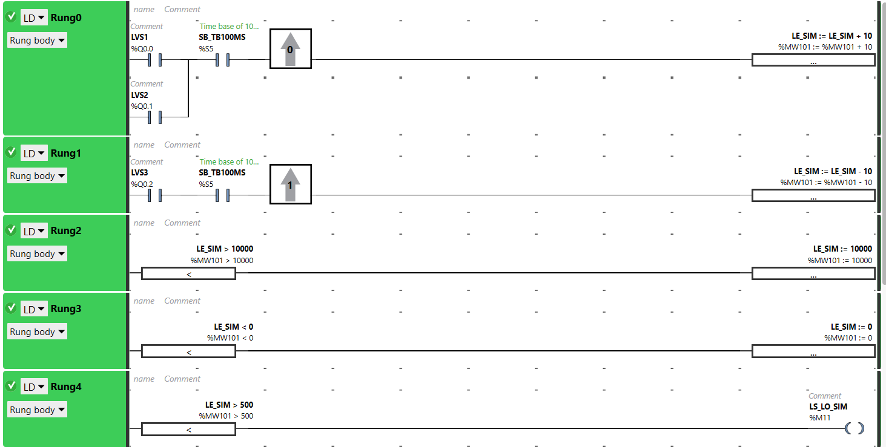

| [<- до лаборних робіт](README.md) | [на основну сторінку курсу](../README.md) |
| --------------------------------- | ----------------------------------------- |
|                                   |                                           |

# Лабораторна робота 5. Робота з Grafset.

## 1. Приклад написання програми користувача з імітацією об'єкта управління.

###### 1.1. Доповнений варіант завдання.

Ознайомтеся з постановкою доповненого завдання для створення програми користувача. Схема технологічної установки, для якої необхідно розробити програму користувача показана на рис.2.1. Нові умови виділено жирним шрифтом. 

рис.1.1. Спрощена апаратурно-технічна схема установки 

Після натискання кнопки "ПУСК", якщо ємність не порожня, повинен відкритися клапан `LVS3`, і присутня в ємності рідина повинна вивантажитися з неї.  Якщо (коли) ємність буде порожня необхідно закрити клапан `LVS3` і відкрити клапан `LVS1` і почати її наповнювати до спрацювання середнього рівня. Після цього необхідно закрити клапан `LVS1` і відкрити `LVS2` для заповнення ємності до верхнього рівня. Потім клапан `LVS2` треба закрити і відкрити клапан `TV1` повністю. Після досягнення температури 50°С клапан треба залишити відкритим на 50%. **Після досягнення значення 55°С треба відкрити клапан `LVS3 ` і  впродовж 30 секунд тримати клапан `TV1` відкритим на 50%. Після вивантаження рідини з апарату закрити клапан`LVS3 `** Якщо не натиснута кнопка "СТОП" - цикл повинен повторюватися.

###### 2.2. Доповнення методики перевірки.

 Табличний вигляд методики перевірки роботи задачі приготування продукту. 

| №    | стан/зміна стану  системи   | SB1  | SB2  | LS1  | LS2  | LS3  | TE1   | LVS1 | LVS2 | LVS3 | TV1  | Примітка                    |
| ---- | --------------------------- | ---- | ---- | ---- | ---- | ---- | ----- | ---- | ---- | ---- | ---- | --------------------------- |
| 1    | початковий  (включення ПЛК) | -    | -    | -    | -    | -    | -     | 0    | 0    | 0    | 0    |                             |
| 2    | Предпуск                    | 0    | -    | -    | -    | -    | -     | 0    | 0    | 0    | 0    |                             |
| 3    | Пуск порожнім               | 1    | 0    | 0    | 0    | 0    | -     | 1    | 0    | 0    | 0    |                             |
| 4    | Пуск не порожнім            | 1    | 0    | 1    | 0    | 0    | -     | 0    | 0    | 1    | 0    | Продовжити перевірку з п.14 |
| 5    | Наповн. нижче рівня LS2     | 0    | 0    | 1    | 0    | 0    | -     | 1    | 0    | 0    | 0    |                             |
| 6    | рівень LS2                  |      |      | 1    | 1    | 0    | -     | 0    | 1    | 0    | 0    |                             |
| 7    | Наповн. нижче рівня LS3     | -    | -    | 1    | 1    | 0    | -     | 0    | 1    | 0    | 0    |                             |
| 8    | рівень LS3                  | -    | -    | 1    | 1    | 1    | -     | 0    | 0    | 0    | 100% |                             |
| 9    | Нагрівання 1                | -    | -    | -    | -    | -    | <50°С | 0    | 0    | 0    | 100% |                             |
| 10   | температура 50°С            | -    | -    | -    | -    | -    | 51°С  | 0    | 0    | 0    | 50%  |                             |
| 11   | Нагрівання 2                | -    | -    | -    | -    | -    | <55°С | 0    | 0    | 0    | 50%  |                             |
| 12   | температура 55°С            | -    | -    | -    | -    | -    | 56°С  | 0    | 0    | 1    | 50%  |                             |
| 13   | Витримка 30 секунд          | -    | -    | -    | -    | -    | >56°С | 0    | 0    | 1    | 50%  |                             |
| 14   | Вивантаження до LS2         | -    | -    | 1    | 1    | 0    | -     | 0    | 0    | 1    | 0    |                             |
| 15   | Вивантаження до LS1         | -    | -    | 1    | 0    | 0    | -     | 0    | 0    | 1    | 0    |                             |
| 16   | Ємність порожня при "СТОП"  | 0    | 1    | 0    | 0    | 0    | -     | 0    | 0    | 0    | 0    | продовжити перевірку з п.2  |
| 17   | Ємність порожня без "СТОП"  | 0    | 0    | 0    | 0    | 0    | -     | 1    | 0    | 0    | 0    | продовжити перевірку з п.5  |

  `-` - вказує незалежність дій від значення вхідних сигналів, бажано перевіряти що стан системи не міняється при зміні цих вхідних сигналів 

###### 2.3. Створення програми.

В секції POU залиште тільки імітатор об'єкту.

Створіть Grafcet POU і реалізуйте програму у відповідності до рисунків нижче

У відповідних кроках за допомогою Add a new rung творіть програму

Step_1

Step_2 залишається порожнім

Step_3

Step_4

Step_5

Step_6

Step_7

Step_8

Step_9

Step_10

Step_11

Умови переходу Transitions задайте у відповідності до рисунків

TR1

TR2

TR3

TR4

TR5

TR6

TR7

TR8

TR9

TR10

TR11

TR12

- Запустіть імітатор ПЛК та запустіть його на виконання.

- Перевірте роботу програми згідно наступної методики перевірки:

  - Включіть відладку за допомогою імітаційної моделі (SIM-->1)

  - Натисніть кнопку "Пуск" в імітаторі ПЛК

  - Переконайтесь, що процес наповнення почався

  - Натисніть кнопку "Стоп" в імітаторі ПЛК

  - Дочекайтеся завершення та зупинки процесу, при цьому перевіряйте правильність роботи алгоритму. Зверніть увагу, що імітовані параметри можна також вводити в Animation table вручну, це може прискорити процес відладки повільних процесів.

| [<- до лаборних робіт](README.md) | [на основну сторінку курсу](../README.md) |
| --------------------------------- | ----------------------------------------- |
|                                   |                                           |