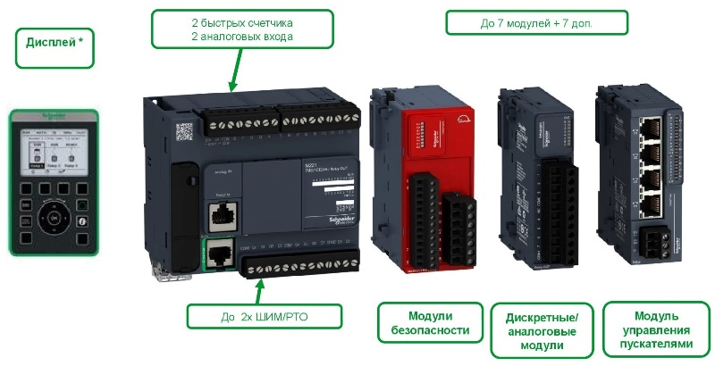
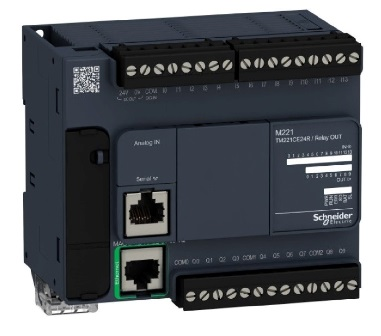
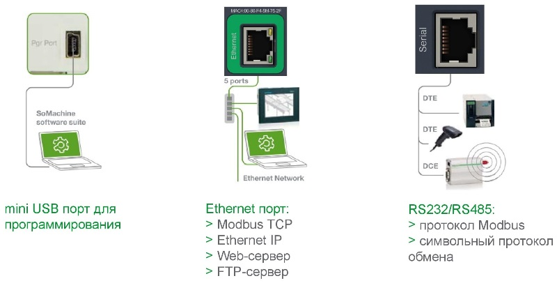
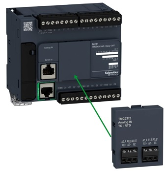
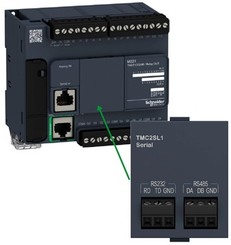
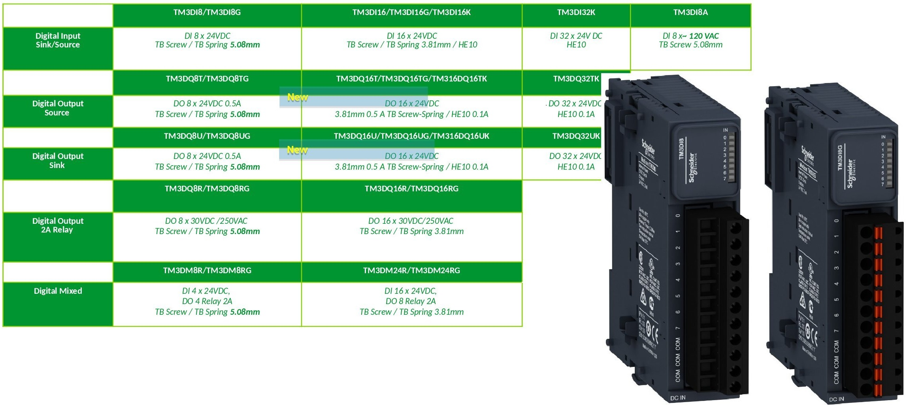

| [<- до лекцій](README.md) | [на основну сторінку курсу](../README.md)               |
| ------------------------- | ------------------------------------------------------- |
|                           | [Режими роботи та структура програм ПЛК ->](1_Modes.md) |

# Фізична структура ПЛК М221 

## Загальна структура ПЛК

ПЛК (програмований логічний контролер) - електронний мікропроцесорний засіб, що використовується для автоматизації технологічних процесів. Він спеціально розроблений для використання у виробничих умовах. ПЛК постійно контролює стан пристроїв вводу та приймає рішення на основі програми користувача для управління станом вихідних пристроїв.

ПЛК повинен відповідати певним вимогам:

- Робота в «жорсткому» реальному часі;
- Тривала автономна робота без обслуговування;
- Стійкість до факторів навколишнього середовища;
- Можливість швидкої заміни компонентів;
- Прості в розумінні мови програмування;
- Можливість перепрограмування «в полі»;
- Можливість обміну даними зі сторонніми пристроями.

ПЛК забезпечує обробку вхідної інформації з об’єкту управління (вхідних змінних процесу) та формування управляючих дій (вихідних змінних процесу) відповідно до програми користувача, яку створює розробник системи управління.

За конструктивним виконанням ПЛК ділять на моноблочні і модульні. У корпусі моноблочного ПЛК поряд з ЦП, пам'яттю і блоком живлення розміщується фіксований набір входів / виходів. У модульних ПЛК використовують модулі входів / виходів, що  встановлюються окремо. Згідно з вимогами МЕК 61131, їх тип і кількість можуть змінюватися в залежності від поставленого завдання і оновлюватися з плином часу. 

Моноблочні ПЛК:

Модульні ПЛК:

### Типи модулів ПЛК

Основні типи модулів ПЛК:

- Блок живлення (PS);

- Центральний процесор (CPU);

- Сигнальні модулі;

- Модулі доступу до промислових мереж;

- Спеціальні модулі.

  

  

  

Джерело живлення може бути вбудованим в основний блок ПЛК, але частіше виконаний у вигляді окремого блоку живлення (БЖ), що закріплюється поруч на стандартній рейці.

CPU - центральний компонент ПЛК. Виконує наступні функції:

- Забезпечує виконання програми користувача;
- Забезпечує циклічне опитування вхідних даних і запис вихідних;
- Виконує діагностику ПЛК в цілому;
- Зберігає програму користувача і всі дані системи.

#### Модулі DI/DO

Модулі DI відрізняються:

- Величиною і типом фізичного сигналу (24 VDC, 220 VAC ...);
- Наявністю спеціальних функцій;
- Максимальною кількістю оброблюваних сигналів.

Модулі DO відрізняються:

- Величиною і типом фізичного сигналу (24 VDC, 220 VAC ...);
- Наявністю спеціальних функцій;
- Максимальною кількістю оброблюваних сигналів;
- Максимальним струмом вихідного сигналу;
- Типом виходу.

Типи дискретних вихідних сигналів

Позитивна і негативна логіка підключення DI

Позитивна і негативна логіка підключення DO

#### Модулі АI/АO

Модулі АI відрізняються:

- Величиною і типом оброблюваного сигналу (0-10 В, 4-20 мА, pt100 ...;
- Наявністю гальванічної розв'язки між каналами;
- Максимальною кількістю оброблюваних сигналів;
- Роздільною здатністю АЦП.

Модулі АO відрізняються:

- Величиною і типом оброблюваного сигналу (0-10 В, 4-20 мА ...);

- Наявністю гальванічної розв'язки між каналами;

- Максимальною кількістю оброблюваних сигналів;

- Роздільною здатністю ЦАП.

  

  

#### Інші модулі

Модулі промислових мереж, призначені для забезпечення можливості зв'язку за певними стандартами промислових мереж, наприклад ModBus RTU, ProfiBus, CanOpen ...
Існують такі типи FieldBus модулів:

- Фізичний інтерфейс без логіки (наприклад RS485);
- Фізичний інтерфейс з логікою (наприклад CanOpen Master)

Спеціальні модулі, призначені для виконання специфічних завдань. Вони мають вбудовані апаратні механізми для реалізації певного функціоналу.
Існують такі типи спеціальних модулів:

- Спеціальні DI, DO, AI, AO;
- Модулі для незалежного управління.

Один ПЛК може обробити від десятків сигналів I/O до сотень тисяч сигналів I/O, в залежності від типу.  Залежно від максимально можливої кількості входів-виходів всі ПЛК поділяють на: 

- мікро -до 64;
- малі -до 128; 
- середні -до 512; 
- великі -до 1024; 
- надвеликі - понад 1024.

Для реалізації  великих проектів може використовуватись архітектура з декількома ПЛК.

## Структура ПЛК М221

### Огляд ПЛК М221

M221 містить:

- SD-карта;
- USB-порт програмування;
- Перемикач RUN / STOP;
- Живлення по USB.

Контролери М221 доступні в двох модифікаціях:

-Контролер Modicon M221 (№ за каталогом TM221C) забезпечують широкі можливості по підключенню і налаштуванню за рахунок використання картриджів введення-виведення, картриджів послідовного порту або спеціальних картриджів без збільшення розмірів контролера.

-Контролер Modicon Modicon M221 Book (№ за каталогом TM221M) поєднують малі габарити і широкий вибір можливостей підключення.

Живлення ПЛК TM221C - 24 Vdc чи 100...240 Vac, для TM221M- 24 Vdc.

Пам'ять М221:

| Тип пам'яті  | Розмір                                                       | Використовується для               |
| ------------ | ------------------------------------------------------------ | ---------------------------------- |
| RAM          | 512 Кбайт оперативної пам'яті: 256 Кбайт для внутрішніх змінних і 256 Кбайт для прогрми і даних. | виконання програми та містить дані |
| Non-volatile | 1,5 Мбайт, з яких 256 Кбайт використовується для резервного копіювання програми та даних у разі відключення електроенергії. | зберігання програми                |

Доступні такі вбудовані типи входів / виходів, залежно від контролера:

- Звичайні входи
- Швидкі входи, пов'язані з лічильниками
- Звичайні транзисторні виходи
- Швидкі транзисторні  виходи, пов'язані з генераторами імпульсів
- Релейні виходи
- Аналогові входи

В залежності від контролера доступні наступні типи портів:

- Ethernet

- USB Mini-B

- SD картка

- Серійний порт

  

Для лінійки TM221C доступні наступні контролери:

Для лінійки TM221M доступні наступні контролери:

### Конфігурація ПЛК М221

Логічний контролер M221 - це система управління, яка пропонує всебічне рішення з оптимізованими конфігураціями та розширюваною архітектурою.

(1)  Локальна конфігурація

(2) Віддалена конфігурація

Контролери М221 можуть розширюватись за допомогою модулів розширення TM3 і TM2. Лінійка модулів розширення ТМ3 прийшла на зміну старішій лінійці ТМ2 разом з контролерами Modicon M221/M241/M251. 

Варто враховувати, що модулі TM2 не можна встановлювати перед TM3.

До контролера максимально можна підключити 7 модулів розширення TM3 і TM2. До модуля розширення TM3XREC1 можна підключити 7 модулів розширення TM3.

Можна розширити кількість входів/виходів або портів зв'язку вашого логічного контролера Modicon TM221C, додавши картриджі TMC2.

М221 - Картриджі розширення:

- 2 аналогових входи/виходи:
  - 0-10 В;
  - 0-20/4-20 мА;
  - Термопари і термосопротивления.

М221 - Картридж послідовного зв'язку:

- RS232/485;
- Modbus RTU/ASCII;
- Символьний режим.

## Модулі TM3

Повністю оновлена система входів/виходів TM3

TM3 - швидкодія:

- Час реакції:
  - 10 x швидше ніж TM2 (Типова конфігурація: 4 дискр. модуля, 2 аналог і 1 експертних);
- Швидкодія:
  - Частота шини 2 МГц замість 1 МГц;
  - Період тиші між байтами зменшений;
  - Зменшено час обробки аналогових сигналів;
- Авто адаптація:
  - Модулі TM2 і TM3 можуть застосовуватися спільно (швидкодія падає до рівня TM2);
- Простота:
  - 1 система модулів входів/виходів для 5 ПЛК та деяких HMI в майбутньому.

- Інтеграція з ПЛК;

- Інтеграція в ПО програмування.

  

| [<- до лекцій](README.md) | [на основну сторінку курсу](../README.md)               |
| ------------------------- | ------------------------------------------------------- |
|                           | [Режими роботи та структура програм ПЛК ->](1_Modes.md) |