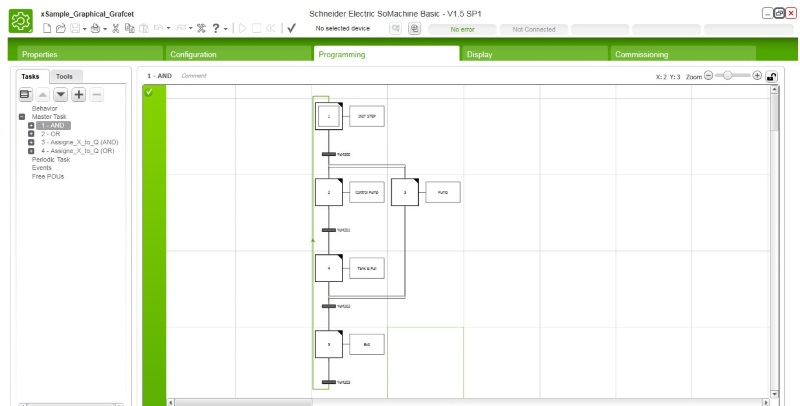
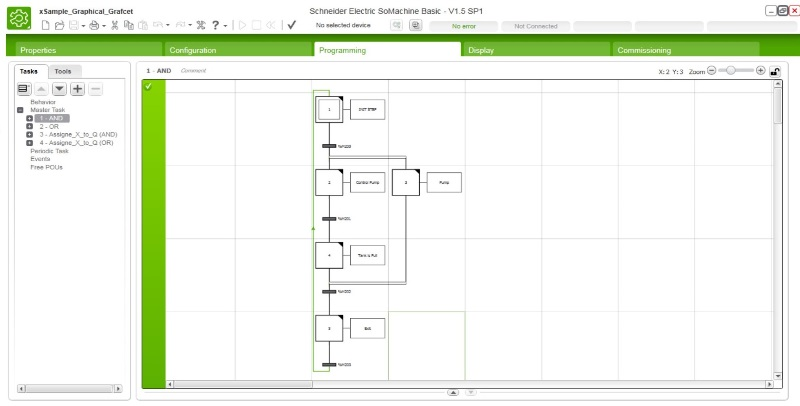
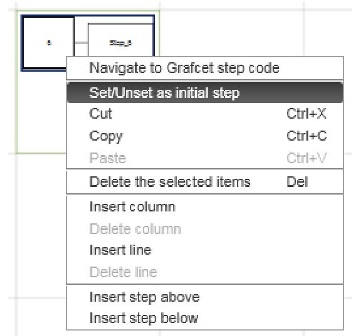
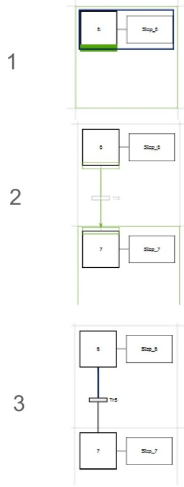
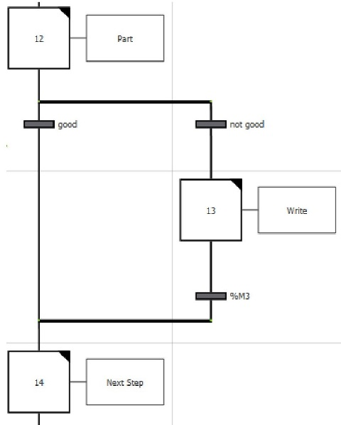

**SFC** - графічна мова програмування, яка описує хронологічний порядок виконання завдань, відомих як кроки. Визначає порядок виконання кроків через переходи, що з'єднують кроки.

SFC містить наступні компоненти:

- **STEP**: Крок виконує набір дій, визначених в одному або в декількох rengs, написаних на будь яких мовах програмування. Кроки можуть бути:
  - *Початковий крок*: виконується на початку програми або після перезапуску контролера. 
  - *Звичайний крок*: кроки, які умовно виконуються після завершення першого кроку, завершують виконання.
- **Transition**: логічний вираз, який перевіряється між кроками. Це зв'язок між двома або більше кроками

Наступна схема є прикладом програми SFC з початковим кроком, одним звичайним кроком, і двома переходами:

1. Початковий крок.
2. Перехід від кроку 1 до кроку 2.
3. Звичайний крок.
4. Перехід із кроку 2 назад до кроку 1. На посилання з'являється стрілка, яка вказує на порядок кроку

Порядок виконання логічним контролером програми SFC:

1. Починається основний цикл робіт.
2. POU, які передують першому кроку Grafcet (SFC), виконуються послідовно.
3. Перший крок SFC запускає Grafcet monitor .
4. Коли Grafcet monitor закінчує виконання програми, запускається перший POU, який слідує за останнім кроком Grafcet (SFC).

Поведінка Grafcet monitor – опис роботи програми :

1. Логічний контролер обробляє системні біти SFC %S21,%S22 та %S23.

2. Логічний контролер оновлює стан активації кожного кроку Grafcet (SFC).

- Кроки, позначені як деактивовані, деактивуються.
- Активуються кроки, позначені для активації.
- Кроки, позначені для активації та деактивації одночасно, будуть залишаться активованими.
- Списки активації та деактивації скидаються.

3. Логічний контролер сканує кроки (цикл від найменшого заданого номера кроку до найвищого визначеного). Якщо сканований крок активний, починає виконуватись відповідний код кроку.

4. Коли код переходу активізує або деактивує крок, ця дія розміщується відповідно в список активації або деактивації для наступного циклу завдань.

5. Коли виконується останній активний код кроку, Grafcet monitor закінчується.

Bits ControllingGrafcet (SFC):

%S21 - Grafcet Initialization - при встановленні значення 1 крок ініціалізації стає активним;

%S22 - Grafcet reset - при встановленні значення 1 активний крок деактивується і виконання перезапускається;

%S23 - Preset and Freeze Grafcet - при встановленні значення 1 виконання програми зупиняється аж до моменту коли значення не стане 0;

%xi - Grafcet steps - Біти %X1 до %Xi пов'язані з кроками. Значення 1 показує на активність кроку, 0 на те що крок не активний. Даний біт доступний лише для читання.

Графічний редактор Grafcet містить сітку комірок. Кожна клітина містить один крок, один перехід, або обидва. Мінімальний розмір програми - це один крок. Максимальна кількість кроків для програми становить 96.

Додати кроки

Двічі клацніть у будь-якій комірці сітки, щоб додати крок, або клацніть правою кнопкою миші у будь-якій комірці сітки та виберіть «Add a step». Ви можете перемістити крок, перетягнувши його в іншу комірку сітки.

Перший крок, створений у Grafcet Graphical Editor, за замовчуванням є початковим кроком. Програма повинна містити хоча б один початковий крок. Можна визначити більш ніж один початковий. Щоб змінити тип кроку (початковий/звичайний), клацніть правою кнопкою миші на кроці та виберіть «Установити / вимкнути» як початковий крок.

Створення переходів

З'єднайте кроки, щоб визначити порядок виконання кроків. Щоб створити перехід між двома кроками необхідно:

1. Навести на нижню частину кроку, коки не зявиться зелена лінія.
2. Натистути на цю лінії і зєднати з потрібним кроком для створення переходу

Програмування кроку можливе в одному або декількох rung IL/Ladder програмах. Двічі клацніть на кроці графічного редактора Grafcet. 

1. Виберіть вузол кроку у перегляді дерева, де n - номер кроку. Результат: Grafcet Графічний редактор закритий.
2. Клацніть правою кнопкою миші на вибраному кроці та виберіть команду «Add rung» з контекстного меню. Результат: у вікні управління проекту під кроком з'явиться створений rung.
3. Створіть необхідну програму на будь якій мові, а також додайте додаткові rung при необхідності.

Програмування переходу можливе в одному або декількох rung IL/Ladder програмах.

1. Двічі клацніть на переході в графічному редакторі Grafcet або виберіть перехід дереві проекту. Результат: Grafcet Графічний редактор закритий.
2. Вкажіть необхідні умови. Вкінці рангу необхідно виконати інструкцію ENDT. Саме вона означатиме що умова переходу спрацювала 

**Розгалуження**

Програма SFC може містити розгалуження. Існує два типи розгалуження:

1. Паралельне розгалуження: два або більше етапів обробляються одночасно, коли попередній перехід істинний.
2. Альтернативне розгалуження: обробляється один або декілька альтернативних етапів залежно від результату попередніх умов переходу

Паралельне відгалуження:

-  Паралельна гілка дозволяє переходити від одного кроку до декількох кроків;
-  Паралельне відгалуження має передувати і слідувати кроком;
-  Паралельні гілки можуть містити вкладені альтернативні гілки або інші паралельні гілки.

Альтернативне відгалуження:

-  Альтернативне відгалуження дозволяє розділити програму на декілька варіантів, виконання яких будуть визначатися умовою переходу;
-  Альтернативна гілка повинна починатися і закінчуватися переходом;
-  Альтернативні гілки можуть містити вкладені паралельні гілки або інші альтернативні гілки.

## Відео

<iframe width="800" height="600" src="https://www.youtube.com/embed/ENCt_tSWKcs" frameborder="0" allow="accelerometer; autoplay; encrypted-media; gyroscope; picture-in-picture" allowfullscreen></iframe>