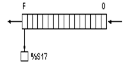
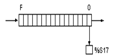
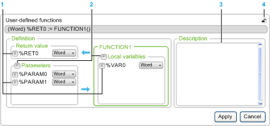
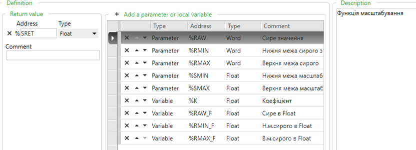
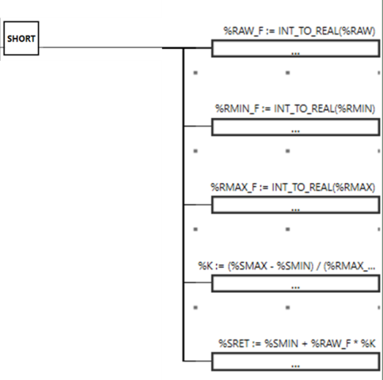

| [<- до лекцій](README.md)        | [на основну сторінку курсу](../README.md) |
| -------------------------------- | ----------------------------------------- |
| [<- PID-регулювання](4_1_PID.md) |                                           |

# Бібліотечні функції та розробка власних функціональних елементів

## Необхідність у створенні власних функціональних елементів 

Хоч для комп'ютерних програмістів використання функцій та об'єктно-орієнтованого підходу до програмування є очевидними речами, програмісти-початківці АСКТП, що розробляють ПЗ для ПЛК, їх можуть взагалі не використовувати. Це часто пов'язано з тим, що останні не мають навики розбивання автоматизованих функцій на повторювані елементи коду. 

Розглянемо приклад. Припустимо на об'єкті є кілька клапанів з датчиками кінцевого положення, для яких необхідно реалізувати:

- окремі режими ручний/автомат
- керування з зовнішньої функції сигналами ВКЛ/ВІДКЛ у автоматичному режимі 
- керування окремим сигналом ВКЛ/ВІДКЛ у ручному режимі
- контроль стану клапану: відкривається, закривається, відкрито, закрито
- сигналізування тривог не відкрився та не закрився, якщо відповідні датчики не спрацювали при відповідному сигналі керування.     

При реалізації алгоритму для цих функцій, наприклад в LD, необхідно кілька ланцюжків . Якщо клапан один, то створення цього коду не потребує виділення окремих функцій. Якщо клапанів кілька, пряма реалізація методом "копі-паста" приведе до того, що кожна частина коду буде повторювати попередню. При цьому змінюватися будуть операнди, які прив'язані до елементів LD.  При реалізації і обслуговуванні коду може виникнути кілька незручностей.  

**По-перше.** Код буде дуже громіздким. Чим більше буде клапанів, тим більше буде програма користувача. Читабельність такого коду також ускладнюється.

**По-друге.** У такому коді зі збільшенням кількості клапанів значно збільшується ймовірність помилки, так як після "копі-паста", кожний елемент треба змінювати під потреби конкретного клапану. Причому зміни необхідно зробити у багатьох місцях.

**По-третє.** Припустимо, код на кілька десятків клапанів повністю відлагоджений і він працює відмінно. Але в житті, навіть самий налагоджений код потребує зміни, коли змінюється завдання. Зміна завдання може бути пов'язане з різними обставинами, але таке буває дуже часто. У цьому випадку задача зміни приводить практично до повного переписування кожного шматка коду.       

Для інших мов проблеми будуть такі самі. Тому для таких ситуацій необхідно робити такі програми користувача, які б повторюваний код реалізовували у вигляді функціональних елементів - підпрограм, функцій, процедур або функціональних блоків. Тобто код реалізовується в одному місці з використанням формальних параметрів, і викликається кілька раз з підстановкою фактичних параметрів. 

Іншими словами, для наведеного прикладу створюється тільки один код для керування клапаном, в якому замість реальних змінних типу `%I`, `%Q`, `%M`, чи інших використовуються якісь локальні, не прив'язані до реального клапану, змінні. При виклику такого коду замість локальних змінних підставляються реальні. При такому підході код буде значно компактніше, краще читабельним, менш піддатний помилкам та простіше змінюватиметься. Останнє пов'язано з тим, що зміни треба вносити тільки в одному місці.               

## Поняття інтерфейсу та області видимості

Функціональні елементи при виклику приймають параметри, які використовуються у його програмі та видають результат роботи. Які параметри будуть використовуватися при виклику означується **інтерфейсом** функціонального елементу.  

Крім параметрів, при написанні програм функціональних елементів є потреба у використанні внутрішніх змінних, які невидимі поза межами цього елементу. Такі змінні називаються локальними. У цей же час, можна користуватися змінними, які видимі у всіх частинах програми, не тільки в межах функціонального елементу. 

У ПЛК M221 змінні з адресами %M, %MW, %Q, %I і т.д. можуть використовуватися у будь якій частині програми, тому є **глобальними**.  **Локальні змінні**  -- це змінні, які можуть бути використані тільки в середині програми самого функціонального блоку або функції і невидимі назовні. Хоч в М221 в межах функціональних елементів можна використовувати глобальні змінні, цього краще уникати. Необхідні змінні варто передавати через параметри інтерфейсу.   

## Функції 

### Особливість функцій

**Функції** - це програмні елементи, які дають (повертають) результуюче значення, що залежить від  вхідних параметрів. Наприклад, виклик функції `ABS(-3.5)` дає значення по модулю від числа `-3.5`, тобто `3`. В середині функції `ABS` може бути реалізований такий  алгоритм:

```
ABS (IN1)
- повертає значення IN1, якщо IN1>0, інакше повертає значення IN1*-1.0
```

 При цьому  `IN1` є формальним параметром, яким оперує ця функція всередині. Кажуть що в `інтерфейсі` цієї функції є один вихід типу `Float`  та один **вхідний параметр** також типу  `Float`. При виклику на місце параметру `IN1` вставляється  значення (наприклад `-3.5`), або змінна (наприклад `%MF100`). Ці підстановлювальні значення, які фактично використовуються в роботі функції називаються **фактичними параметрами**. 

Результат виклику функції завжди залежить лиш від значення вхідних параметрів. Це значить, що функції не можуть зберігати проміжні внутрішні результати, які будуть впивати на наступний виклик, тобто вони не мають пам'яті. Крім того функції завжди повертають одне розраховане значення і не впливають на фактичні параметри.  

У "EcoStruxure Machine Expert - Basic" функції користувача хоч і можуть зберігати значення змінних між викликами, але ці значення доступні для кожного виклику. 

Система "EcoStruxure Machine Expert - Basic"  надає велику кількість бібліотечних функцій та має спеціальні оператори. Деякі з них наведені нижче. Крім того, можна написати власні функції, використовуючи мови `LD` або `IL`.

### Бібліотека системних функцій

У  "EcoStruxure Machine Expert - Basic" є функції роботи з різними числовими параметрами.  

Таб.1. Функції та оператори для роботи з цілими та дійсними числовими параметрами

| Operator                        | Function                                                     |
| ------------------------------- | ------------------------------------------------------------ |
| REM                             | Залишок ділення 2-х операндів                                |
| SQRT(Op2)                       | квадратний корінь                                            |
| LOG(Op2)                        | Алгоритм з 10-ковою базою                                    |
| LN(Op2)                         | натуральний логарифм                                         |
| TRUNC(Op2)                      | відкинення дробової частини `TRUNC(927.8904)` дасть `927`    |
| EXP(Op2)                        | натуральний показник (`e` в степені)                         |
| EXPT(Op2,Op3)                   | взведення в степінь                                          |
| SIN, COS, TAN, ASIN, ACOS, ATAN | тригонометричні функції                                      |
| DEG_TO_RAD, RAD_TO_DEG          | перетворення відповідно градусів в радіани та радіанів в градуси |
| INC                             | інкремент (збільшення на 1)                                  |
| DEC                             | декремент (зменшення на 1)                                   |
| ABS(Op2)                        | абсолютне значення операнду                                  |
| BTI(Op2)                        | перетворення BCD в Binary                                    |
| ITB(Op2)                        | перетворення Binary в BCD                                    |
| LW(Op2)                         | отримання молодшого слова з подвійного слова                 |
| HW(Op2)                         | отримання старшого слова з подвійного слова                  |
| CONCATW (Op2, Op3)              | конкатенація (об'єднання) 2 слів в подвійне слово            |
| DWORD(Op2)                      | перетворення одинарного (16-бітного) слова в подвійне слово (32-бітне) |

При необхідності побітових операцій зсуву користувачу надаються типові функції, означені  в стандарті IEC 61131-3.

Таб.2. Робота з словами як з бітовими послідовностями.

| Instruction | Function                                                     |                                                            |
| ----------- | ------------------------------------------------------------ | ---------------------------------------------------------- |
| SHL(op2,n)  | зсув бітів на n позицій ліворуч                              |                                      |
| SHR(op2,n)  | зсув бітів на n позицій праворуч                             |                                    |
| ROL(op2,n)  | круговий зсув бітів на n позицій ліворуч, з добавленням "випавших" бітів праворуч |                                      |
| ROR(op2,n)  | круговий зсув бітів на n позицій праворуч, з добавленням "випавших" бітів ліворуч |                                    |
|             |                                                              | n - ціле число:  для word: 1...16, для double word: 1...32 |

Як у більшості ПЛК, в М221 повинна забезпечуватися жорстка типізація. Це значить, що не можна проводити операції з різними типами даних. Так, наприклад, щоб до цілого числа додати дійсне (з плаваючою комою), їх треба привести до одного з двох типів. Для цього використовуються функції перетворення типів. 

Таб.3. Функції перетворення типів.

| Operator     | Function                                                     |
| ------------ | ------------------------------------------------------------ |
| INT_TO_REAL  | перетворення цілого значення в значення з плаваючою комою    |
| DINT_TO_REAL | перетворення подвійного слова (integer) в значення з плаваючою комою |
| REAL_TO_INT  | перетворення значення з плаваючою комою в ціле (з округленням) |
| REAL_TO_DINT | перетворення значення з плаваючою комою в подвійне ціле (з округленням) |

Крім наведених вище функцій, "EcoStruxure Machine Expert - Basic" підтримуються також:

- функції роботи з текстовими змінними `ASCII` 
- оператори роботи зі стеком
- оператори роботи з таблицями (масивами)
- інструкції роботи з входами/виходами (негайне зчитування/запис)

Розгляд даних функцій виходить за рамки даної лекції.

### Функції користувача в М221 (User Defined Fucntion)

**Функція користувача** (**user-defined function**) - створюються на базі мов `IL` та `LD` з використанням інтерфейсу. У інтерфейсі означуються вхідні параметри, локальні змінні та значення, що повертається. Функції користувача зберігаються як частина проекту "EcoStruxure Machine Expert - Basic". Після їх створення, їх можна викликати у задачах Master, Periodic,  Events або Free POUs.

У програмі реалізації функції користувача дозволяється використовувати будь як глобальні змінні (наприклад `%M`, `%MW` ... ) а також спеціальні об'єкти інтерфейсу функції користувача, а саме:

- **%RET0** - значення, що повертає функція; може бути типів `Word`, `Double` або `Float` 
- **%PARAMn** - вхідний параметр функції, який вказується при виклику функції; 
- **%VARn**  - локальна змінна функції користувача; вона слугує внутрішньою змінною для розрахунку. 

У нових версіях системи, адреси цих параметрів можна змінювати, але вони завжди починаються зі знаку `%`. 

Таким чином параметри використовуються для передачі необхідних значень у функцію, а результат функції виводиться як `%RET0`. Змінні функції користувача використовуються для проміжних розрахунків і збереження їх між викликами. При цьому збережене значення є спільним для всіх викликів. Параметри і змінні не можуть бути використані для зміни та відображення в таблиці анімації чи в програмі користувача, за винятком передачі значень параметрам при виклику функції. 

Наступний рисунок показує дії, доступні у вікні `Properties` функції користувача:



> 1 - видалення змінних, параметрів та значення, що повертається, 2 - добавлення змінних, параметрів та значення, що повертається, 3 - необов'язковий опис цілей функції користувача, 4 - відкріплення вікна властивостей

У програмі реалізації функції користувача можна використовувати інші функції користувача, однак не саму себе, тобто не дозволяється рекурсивний виклик. 

Після створення функції користувача вона може бути використана в програмі в  `Operation  Block` або `Comparison Block` так само як і інші (системні) функції.  

Функції користувача зберігаються разом з проектом. Якщо необхідно використати її в інших проектах, її можна експортувати а потім імпортувати в проект.  

### Приклад створення користувацької функції

Розглянемо приклад, в якому необхідно зробити масштабування вимірюваного значення з аналогового входу в інженерні одинці. Враховуючи що вимірювальне значення отримується з аналогового входу через змінну `%IW` в цілочисельному форматі (наприклад в діапазоні 0-10000), при відображенні оператору воно неінформативне. Для відображенні на засобах людино-машинного інтерфейсу (ЛМІ), наприклад панелях оператора чи комп'ютері, його необхідно перетворити в інженерні одиниці. Таке перетворення прийнято називати масштабуванням. Як правило, засоби ЛМІ вміють робити лінійне масштабування, однак інколи необхідно це робити на самому ПЛК. 

Лінійне масштабування, тобто перетворення вхідних `сирих` одиниць у `інженерні` масштабовані може проводитися за формулою (див. рис.3.4):

```mathematica
S = k*R + Sb 			(1)
```

де `S `– отримуване масштабоване значення в інженерних одиницях; `R` – вхідне сире немасштабоване значення, `Sb` – зміщення; `k` – коефіцієнт, який дорівнює тангенсу кута нахилу прямої масштабування до осі абсцис.     


рис.2. Лінійне масштабування

Задавання масштабування у вигляді (1) вимагає від розробника додаткових розрахунків. Замість цього зручніше задавати тільки мінімальні та максимальні межі для *сирого* (*raw*) і *масштабованого* (*scaled*) значення. На рис.2 межі сирого значення показані як `Rmax` та `Rmin`, а масштабованого як `Smax` та `Smin`. Так, наприклад, якщо в ПЛК значення від датчика задається в діапазоні від 0-10000 (одиниць ПЛК) а на ЛМІ воно повинно відображатися як 50.0-150.0 (°С), то:

```mathematica
Rmin = 0 (одиниць ПЛК) –> Smin = 50.0 (°С)
Rmax = 10000 (одиниць ПЛК) -> Smax = 150.0 (°С)
```

Формула визначення `S` з використанням змінних діапазонів матиме вигляд:

```mathematica
S = Smin + (R-Rmin)(Smax-Smin)/(Rmax-Rmin) 				(2)
```

Реалізуємо формулу (2) у вигляді функції. Параметрами функції будуть усі необхідні вхідні значення, потрібні для масштабування:

- `%RAW` - сире значення вимірювальної величини типу `WORD`
- `%RMIN`- нижня межа сирого значення вимірювальної величини типу `WORD`
- `%RMAX`- верхня межа сирого значення вимірювальної величини типу `WORD`
- `%SMIN` - нижня межа масштабованого значення величини типу `Float`
- `%SMAX` - верхня межа масштабованого значення величини типу `Float`

Виходом функції буде масштабоване значення `%SRET` типу `Float`.

У процесі розрахунку необхідно робити проміжні перетворення. Зокрема, треба перетворити цілі числа у дійсні, щоб зробити арифметичні операції, наведені в формулі (2), тому що не дозволяється робити обчислення з різними типами. Зрештою, можна б було написати одну велику формулу, яка б враховувала і ці перетворення, однак в середовищі є певні обмеження на максимальну кількість операндів. Тому додатково необхідно ввести проміжні змінні: 

- `%K` - для розрахунку співвідношень масштабів 
- `%RAW_F` - сире значення вимірювальної величини перетвореного в `Float`
- `%RMIN_F` - нижня межа сирого значення вимірювальної величини перетвореного в `Float`
- `%RMAX_F` - верхня межа сирого значення вимірювальної величини перетвореного в `Float`

Загальний вигляд інтерфейсу функції користувача матиме вигляд:

 

рис.3. Інтерфейс функції масштабування 

Код функції по суті вміщує тільки обчислення, без логіки. Наглядніше б було зробити його на мові `IL`, тим не менше для універсальності нижче показаний код на мові `LD`. 



рис.4. Реалізація коду функції масштабування 

Перші три оператори переводять значення з типу `INT` в `REAL` Четвертий оператор розраховує частину формули `(Smax-Smin)/(Rmax-Rmin) `, останній вже робить кінцевий розрахунок:

```
%SRET := %SMIN + %RAW_F * %K
```

На рис.5 показаний приклад використання функції користувача `SCALE`. Перший виклик функції реалізовує перетворення виміряного значення з аналогового входу, вбудованого в модуль ЦПУ (`%IW0.0`) в діапазон `0-100%`. Другий виклик реалізовує перетворення з аналогового входу модуля  `%IW1.0` в значення сигналу `50.0-150.0 °C`. Значення записуються в `%MF100` та `%MF102`. 

>  Зверніть увагу, що змінні `%MF` знаходяться в комірках пам'яті через одну, оскільки `%MF100` займає дві комірки підряд, тобто `%MW100` та `%MW101`, а `%MF101` - `%MW101` та `%MW102`.  


рис.5. Реалізація прикладу використання функції масштабування 

## Розробка власних функціональних блоків

### Відмінність функціональних блоків від функції

Функції не мають пам'яті. Хоч в М221 можна зберігати значення між викликами, воно спільне для кожного виклику. Щоб зрозуміти, коли необхідна для виклику пам'ять розглянемо програмний лічильник. Лічильник повинен підраховувати кількість імпульсів на його вході. Для того, щоб ця кількість десь зберігалася, необхідна внутрішня змінна. У функціях користувача М221 є внутрішні змінні, які зберігають значення між викликами. Але якщо лічильників буде кілька, кожен виклик буде працювати з одним і тим же екземпляром, тобто значенням лічильнику, що очевидно не підходить для даної задачі. Тобто кожен виклик функції лічильника повинен вміщувати свою локальну копію (**екземпляр**) значення лічильника. 

Функції, що зберігають локальні дані у окремому, виділеному для неї блоці пам'яті називають **функціональними блоками**.  Тобто `функціональний блок` = `функція` + `локальні дані для неї`. Тому для кожного екземпляру функціонального блоку виділяється пам'ять. Саме тому, при виклику лічильника - вибирається один з екземплярів (`%C0`, `%C1` і т.д). Якщо викликати  один екземпляр кілька раз, буде проводитися обрахунок з тим же значенням лічильнику. Те саме стосується і інших функціональних блоків. 

Оскільки виклик функціонального блоку потребує окремого виділення пам'яті, то кажуть що є:

- **тип функціонального блоку** -  який вказує на програмну реалізацію 
- **екземпляр функціонального блоку** - який вказує на виділену пам'ять     

У  "EcoStruxure Machine Expert - Basic" є велика кількість функціональних блоків, яка розглядалася в кількох попередніх лекціях, зокрема в

- [Використання базових функціональних блоків (таймерів та лічильників)](4_fb.md) 
- [Використання експертних функціональних блоків](11_exp_fb.md) 
- [Використання експертних функціональних блоків PID](4_1_PID.md) .      

Окрім цього, для М221 можна створювати власні функціональні блоки на мовах `IL` та `LD`.        

### Функціональні блоки в М221 (User Defined Fucntion Blocks)  

**Функціональні блоки користувача** (**UDFB**, User Defined Fucntion Blocks) - це функціональні блоки, які розробляються на мовах програмування ПЛК. У М221 їх можна викликати в задачах Master, Periodic, Events  і Free POUs.

Так саме, як і в функціях, у функціональних блоках доступні для використання параметри, локальні та  глобальні змінні.

- **%PARAMn** - параметр функції користувача, який вказується при виклику функції;може бути типів   `Word`, `Double` або `Float` ;
- **%VARn**  - локальна змінна функції користувача; вона не вказується при виклику і слугує внутрішньою змінною для розрахунку та збереження проміжних результатів між викликами; може бути типів `Word`, `Double` або `Float`  

Наступний рисунок показує дії, доступні у вікні `Properties` для функціональних блоків користувача:


> 1 - добавлення входів та виходів змінних, 2 - видалення входів/виходів, 3 - видалення параметру або локальної змінної, 4 - добавлення параметру або локальної змінної, 5 - опис призначення функціонального блоку, 6 - відкріплення вікна властивостей, 7 - кількість використаних екземплярів даного типу функціонального блоку


### Приклад створення користувацького ФБ


| [<- до лекцій](README.md)        | [на основну сторінку курсу](../README.md) |
| -------------------------------- | ----------------------------------------- |
| [<- PID-регулювання](4_1_PID.md) |                                           |