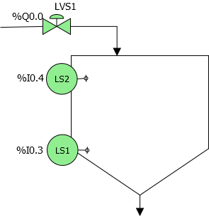
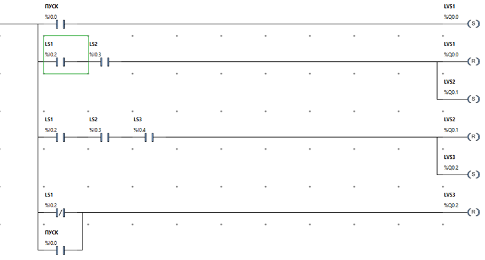
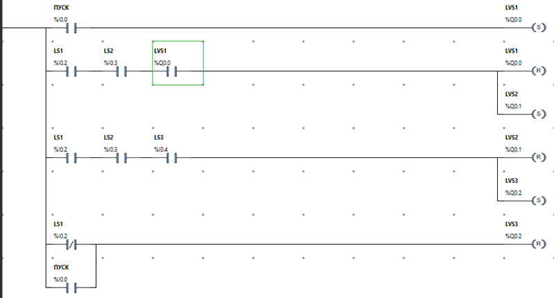
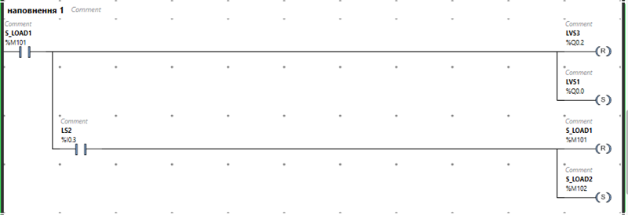
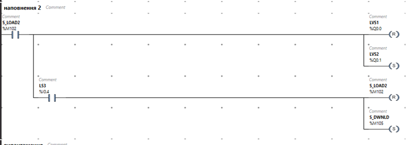
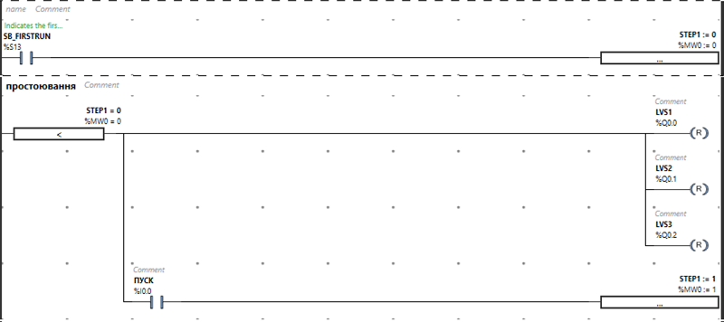
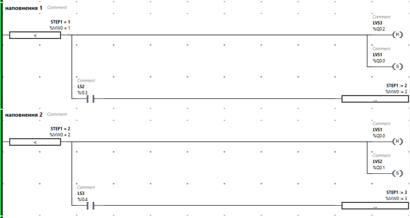

| [<- до лекцій](README.md)                        | [на основну сторінку курсу](../README.md)            |
| ------------------------------------------------ | ---------------------------------------------------- |
| [<- Розширені функціональні блоки](11_exp_fb.md) | [Методки та засоби перевірки програм ->](testing.md) |

# Стано-орієнтовне програмування

## Керування з прямою залежністю вхід-вихід

Алгоритми для простих об'єктів можуть обмежуватися керуванням виконавчими механізмами за перевіркою значень датчиків. Тобто є вхід з об'єкта, який показує його ***стан*** через датчики, і є виконавчі механізми, якими керує ПЛК. Робота простого алгоритму зводиться до того, що ПЛК перевіряє значення датчиків і генерує відповідне керування. 

**Приклад 1.** Наприклад необхідно реалізувати програму включення насосу при натиснутій кнопці "ПУСК" але за умови, що в ємності є рідина. Це може бути реалізовано простим фрагментом програми, як показано на рис.1


рис.1. Приклад простої програми залежності виходу (керування ВМ) від входу (датчиків).

У даному випадку вихід на реле керування насосом повністю залежить тільки від контакту кнопки "ПУСК" та сигналізатора нижнього рівня. Незалежно від того, який стан передував цій ситуації, алгоритм буде завжди такий:

```
Якщо натиснута кнопка "ПУСК" і ємність не порожня, тоді включити насос інакше відключити насос. 
```

Зверніть увагу, що у даному прикладі людина повинна тримати кнопку натиснутою, щоб насос працював.

Аналогічно можна розглядати задачу П-регулювання, в якій вихід на ВМ залежить тільки від заданого, дійсного (вимірювального) значення та налаштувнь регулятору. 

**Приклад 2.** Розглянемо для прикладу іншу задачу.  Необхідно підтримувати рівень в буферній ємності живлення водою між нижнім та верхнім датчиком. Тобто, якщо рівень падає нижче нижнього сигналізатора (`LS1`) - необхідно відкрити клапан набору (`LVS1`), якщо вище `LS2` - закрити. 



рис.2.Буферна ємність живлення водою.

Спробуємо описати алгоритм керування з використанням одних тільки датчиків. Отже у нас є всього два датчики - нижнього рівня і верхнього рівня, які показують що в ємності є рідина на певній висоті. Що вони значать? Спробуємо представити стан об'єкта за комбінацією цих датчиків у вигляді таблиці.

Таб.1.

| LS1  | LS2  | Стан об'єкта (ємності живлення)                              |
| ---- | ---- | ------------------------------------------------------------ |
| 0    | 0    | ємність порожня                                              |
| 0    | 1    | один з датчиків вийшов з ладу, адже не може працювати сигналізатор верхнього рівня, коли не працює нижнього |
| 1    | 0    | рідина між верхньою і нижньою позначкою                      |
| 1    | 1    | ємність повна                                                |

Дивлячись на таблицю 1, можна оцінити, що робочих станів всього три: ємність порожня, ємність непорожня і ємність повна (вище поділки LS2). Спробуємо описати, що необхідно робити в цих 3-х станах:

Таб.2.

| LS1  | LS2  | Стан об'єкта                            | Дія (LVS1) | Примітка                                                     |
| ---- | ---- | --------------------------------------- | ---------- | ------------------------------------------------------------ |
| 0    | 0    | ємність порожня                         | 1          |                                                              |
| 1    | 0    | рідина між верхньою і нижньою позначкою | 1 або 0?   | клапан LVS1 - відкритий при наборі і закритий в іншому випадку |
| 1    | 1    | ємність повна                           | 0          |                                                              |

Як бачимо, за порожньої і за повної ємності зрозуміло що робити з клапаном. А от в проміжній ситуації маємо нестачу інформації. Якщо написати програму, залежності виходу тільки від значення датчиків необхідно передбачати підстани в ситуації, коли рідина знаходиться між відмітками LS1 та LS2: при наборі та в іншому випадку. Чи обов'язково це передбачати?

Якщо не означуватися з підстанами, тоді треба вказати що робити з клапаном в цій ситуації. 

- тримати закритим (`LVS1=0`), тобто  `LVS1` буде дорівнювати 1 тільки коли нижній датчик показує 0; у цьому випадку біля відмітки `LS1` клапан буде закриватися і відкриватися з великою частотою: оскільки при зливі рідина буде падати нижче, коли клапан набору закритий і одразу ж буде відкриватися, що в свою чергу приведе до підняття рівня і т.д. Так можна швидко вивести з ладу клапан. Крім того, передбачено зовсім не такий алгоритм (можна, наприклад, і затримку по часу зробити). І навіщо тоді датчик верхнього рівня? 
- Якщо тримати відкритим (`LVS1=1`), тобто `LVS1` буде дорівнювати 1 тільки коли верхній датчик показує 0,  тоді попередня ситуація буде повторюватися тільки вже біля відмітки `LS2` за тієї ж причини.       

 Чи можна за двома датчиками визначити яка зараз ситуація - набор чи злив? Якщо датчики не спеціалізовані, то вочевидь --- ні. Треба плинний стан визначати в залежності від датчиків та попереднього стану системи. Це можна зробити кількома способами:

- визначати стан об'єкта через стан виконавчих механізмів, якими керує сама програма;
- визначати стан об'єкта через переходи значення датчиків з 0 в 1 (передній фронт) і навпаки - з 1 в 0 (задній фронт);
- створити змінні стану, якими буде керувати логіка програми користувача і які будуть використовуватися в алгоритмі керування як додаткові аргументи (умови).           

## Керування з використанням стану ВМ

Один із варіантів врахування стану - це використовувати команди ВКЛ та ВІДКЛ. Тобто керування включенням та відключенням відбувається за певних умов, а сам стан ВМ вже характеризує стан об'єкту. 

Для такого підходу, нас цікавить тільки дії в двох станах - коли ємність повністю порожня і коли ємність повністю повна, в інших станах - програма просто нічого не робить.   У табличному вигляді це матиме вигляд.

| LS1  | LS2  | Стан об'єкта (ємності живлення)         | Дія(LVS1)        |
| ---- | ---- | --------------------------------------- | ---------------- |
| 0    | 0    | ємність порожня                         | ВКЛ (SET)        |
| 1    | 0    | рідина між верхньою і нижньою позначкою | нічого не робити |
| 1    | 1    | ємність повна                           | ВІДКЛ (RESET)    |

Програма керування може мати наступний вигляд.


рис.3.

Це був дуже простий приклад, розглянемо приклад складніше.

**Приклад 3.** У даному прикладі необхідно реалізувати програму керування установкою приготування суміші, яка описується наступним алгоритмом:

- при натискання кнопки `Пуск` (без фіксації) треба закрити `LVS2`, відкрити `LVS1` та наповнити апарат до рівня `LS2` після чого закрити `LVS1` і відкрити `LVS2`;
- після спрацювання верхнього рівня клапан `LVS2` треба закрити і відкрити клапан `LVS3` для вивантаження суміші з апарату;
- після вивантаження суміші (коли `LS1=0`) необхідно закрити клапан `LVS3`      


рис.4.

Спробуємо вирішити програму "в лоб", без використання таблиць стану. Це типовий підхід, яким користуються більшість програмістів, так як на створення таблиць стану йде багато часу. Програма може мати наступний вигляд .



рис.5.

Уважно подивіться на цю програму, продумайте як вона працює. Чи знайдете в ній помилки? Не звертайте уваги на нюанси, такі як, наприклад, що закриття клапану відбувається тільки по нижньому рівню (інші стани датчиків не враховуються). 

Якщо Ви не можете знайти помилку проаналізувавши роботу програми, необхідно зробити таблицю перевірки. Враховуючи що у даному випадку система у кожен момент часу перебуває у певному стані, поведінка програми залежить не тільки від входів але і від теперішнього стану. Тому перевірка правильності виконання задачі зводиться до перевірки поведінки виходів ПЛК при зміні стану та входів ПЛК. Це зручно оформити у вигляді таблиці. При перевірці послідовно змінюють значення вхідних змінних (ПУСК, LS1, LS2, LS3) і дивляться на те, як змінюються вихідні змінні.  

Таб.3.Таблиця перевірки.

| №    | стан/зміна стану  системи  | ПУСК | SB2  | LS1  | LS2  | LS3  | LVS1 | LVS2     | LVS3 | Примітка        |
| ---- | -------------------------- | ---- | ---- | ---- | ---- | ---- | ---- | -------- | ---- | --------------- |
| 1    | Предпуск                   | 0    | -    | -    | -    | -    | 0    | 0        | 0    | початковий стан |
| 2    | Пуск                       | 1    | 0    | 0    | 0    | 0    | 1    | 0        | 0    |                 |
| 3    | Наповн. нижче рівня LS2    | 0    | 0    | 1    | 0    | 0    | 1    | 0        | 0    |                 |
| 4    | Наповн до рівня LS2        |      |      | 1    | 1    | 0    | 0    | 1        | 0    |                 |
| 5    | Наповн. нижче рівня LS3    | -    | -    | 1    | 1    | 0    | 0    | 1        | 0    |                 |
| 6    | рівень LS3                 | -    | -    | 1    | 1    | 1    | 0    | 0        | 0    |                 |
| 7    | Вивантаження до LS2        | -    | -    | 1    | 1    | 0    | 0    | 0**(1)** | 1    |                 |
| 8    | Вивантаження до LS1        | -    | -    | 1    | 0    | 0    | 0    | 0        | 1    |                 |
| 9    | Ємність порожня при "СТОП" | 0    | 1    | 0    | 0    | 0    | 0    | 0        | 0    |                 |

Якщо перевіряти програму крок за кроком, то як виявиться, на кроці 7, клапан `LVS2` відкриється, тоді як він повинен залишатися без змін. Це пов'язано з тим, що між датчиком `LS2`  та `LS3` рідина знаходиться в 2-х випадках - при наборі 2-го продукту (`LVS2`)  і при вивантаженні. Враховуючи, що умова на закриття клапану набору (`LVS2`) вже не спрацьовує, а на відкриття так, то клапан на кроці 7 знову відкрився. Як видно, значення датчиків співпадають на кроках 4,5 та 7, тому необхідно ввести додаткову змінну, яка б однозначно вказувала на стан. Для цього можна використати стани клапанів.  У даному випадку достатньо, наприклад, відкривати клапан набору `LVS2` при додатковій умові, коли `LVS1`  відкритий, тобто коли йде набір 1.        

   

рис.6.

## Керування за переходом (фронтами)

Інший спосіб реалізації подібних задач передбачає використання перехідних станів від датчиків за допомогою фронтів. Наприклад, можна орієнтуватися на наступні стани за переходами:

Таб.4.

| Датчик | Перехід (фронт)     | Стан                              |
| ------ | ------------------- | --------------------------------- |
| LS1    | 0->1 (передній `P`) | проходить набір в зоні LS1        |
| LS1    | 1->0 (задній `N`)   | проходить вивантаження в зоні LS1 |
| LS2    | 0->1 (передній `P`) | проходить набір в зоні LS2        |
| LS2    | 1->0 (задній `N`)   | проходить вивантаження в зоні LS2 |
| LS3    | 0->1 (передній `P`) | проходить набір в зоні LS3        |
| LS3    | 1->0 (задній `N`)   | проходить вивантаження в зоні LS3 |

Кожен з цих переходів дає додаткову інформацію про стан об'єкту. Тому програма керування може мати вигляд як на наступному рисунку.   


рис.7.

Цей спосіб має свої обмеження. По-перше, за такого підходу не можна використовувати програмні фільтри дискретного сигналу. По-друге, для аналогових датчиків це не буде працювати, оскільки фронти для числових сигналів не ловляться (хіба що зміна значення на певну величину). 

Можна також використовувати  комбінацію з наведених вище способів. Однак для дуже великих задач, коли кількість станів вимірюється десятками, можна використати інший спосіб, де стани виділяються явно і для них задаються окремі змінні.   

## Стано-орієнтоване керування.  

При ***стано-орієнтованому керуванні*** (***state-based control***) стани функцій системи виділяють явно, і кожному дають своє ім'я та змінну або значення змінної. Таким чином означують в якому стані перебуває система і для кожного зі станів прописують свою логіку керування. 

### Означення стану через дискретні змінні.

У наведеному вище прикладі завдання, описана лише одна функція керування для ПЛК - задача керування приготуванням суміші.  При цьому ця задача має початок і закінчення, а також має стани, в яких система керування має вести себе різним чином:

- Простій, очікування пуску задачі: тримати усі клапани у закритому положенні
- Наповнення речовиною 1: відкрити `LVS1` та закрити `LVS3`
- Наповнення речовиною 2: закрити `LVS1` та відкрити `LVS2`
- Вивантаження продукту: закрити `LVS2` та відкрити `LVS3`

Для кожного стану можна виділити окремі змінні, які будуть вказувати на активність стану.

Таб.5. Змінні стану.

| Стан                             | Змінна | Символьна назва | Примітка    |
| -------------------------------- | ------ | --------------- | ----------- |
| Ініціалізація ПЛК                | %S13   | SB_FIRSTRUN     | Перший цикл |
| Простій, очікування пуску задачі | %M100  | S_IDLE          |             |
| Наповнення речовиною 1           | %M101  | S_LOAD1         |             |
| Наповнення речовиною 2           | %M102  | S_LOAD2         |             |
| Вивантаження продукту            | %M105  | S_DWNLD         |             |

Окрім стандартних станів варто передбачати окремі "системні" стани, як наприклад, стан "Ініціалізації ПЛК", що показаний в таблиці.  

Тепер логіка програми керується такими принципами:

- в умовах керування використовувати перевірку стану: `Якщо стан <такий то> робимо <такі-то дії> при <таких то умовах>`;
- керувати зміною стану: `якщо стан <такий то> і спрацювала умова переходу на інший стан - змінити стан (змінну стану) `

Оскільки для кожного стану виділена окрема дискретна змінна, то логіка перевірки стану буде зводитися до умови по "ТА" зі значенням змінної конкретного стану, тобто послідовно включений контакт в LD.  Логіка керування станами буде передбачати включення необхідної змінної стану та виключення змінної плинного стану. 

На кроці ініціалізації, тобто при першому циклі (коли системний біт `%S13=1`), усі змінні стану скидаються,  а змінна стану "Очікування" виставляється в `1`. Таким чином при старті ПЛК, програма керування завжди буде стартувати зі стану очікування. 


рис.8.

Інші стани враховуються як додаткова умова.







рис.9.

Як видно з рисунку, наведена програма програє в компактності попереднім варіантам. Але чим складніше задача (кількість станів, перехресних умов), тим ефективніше стає її вирішення через використання стано-орієнтованого підходу. Крім того, так задачу легше обговорювати з технологом і вона менш підвержена помилкам та простіше відлагоджується.  

### Означення стану через змінну кроку.

Використання дискретних змінних в якості змінних стану дають можливість запускати кілька станів одночасно. Для деяких задач це актуально, наприклад, коли необхідно паралельно виконувати декілька дій, які означуються різними умовами. Однак велика кількість станів передбачає використання великої кількості змінних, що дуже не зручно. Якщо передбачається лінійне виконання програми керування станами, тобто коли в один момент часу тільки один стан є активним, можна використовувати одну числову змінну стану, яку також можна назвати ***"кроком"***. 

За такого підходу, змінна стану буде тільки одна, а змінюватися будуть тільки числа - номери кроку. Наприклад, за змінну стану можна взяти `%MW0`, яка може прийняти аж 65535 комбінацій, що достатньо навіть для самої великої програми, яку може витримати цей тип ПЛК.  

Таб.6.

| Стан                             | Значення | Примітка    |
| -------------------------------- | -------- | ----------- |
| Ініціалізація ПЛК                | %S13     | Перший цикл |
| Простій, очікування пуску задачі | 0        |             |
| Наповнення речовиною 1           | 1        |             |
| Наповнення речовиною 2           | 2        |             |
| Вивантаження продукту            | 3        |             |

Тепер програма буде перевіряти номер кроку, щоб визначити, в якому стані заходиться система, і виставляти потрібне значення кроку, при необхідності переходу в інший стан .  






рис.10

За наведеним принципом можна розробляти алгоритмічно дуже складні системи керування. Є спеціалізована мова програмування (SFC/Grafcet), яка побудована за цим принципом. Ця мова буде розглядатися на одній із наступних лекцій. Багато сучасних стандартів керування також включають стано-орієнтоване керування в якості базового принципу.   


Лектори - Олександр Пупена, Ігор Володимирович Ельперін. [АКТСУ НУХТ](http://www.iasu-nuft.pp.ua)

| [<- до лекцій](README.md)                        | [на основну сторінку курсу](../README.md)            |
| ------------------------------------------------ | ---------------------------------------------------- |
| [<- Розширені функціональні блоки](11_exp_fb.md) | [Методки та засоби перевірки програм ->](testing.md) |