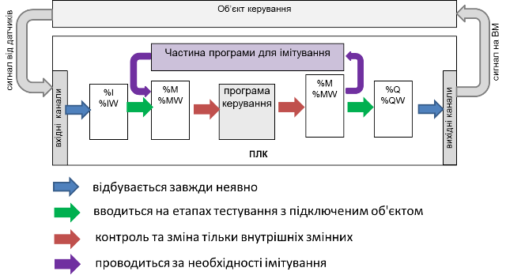
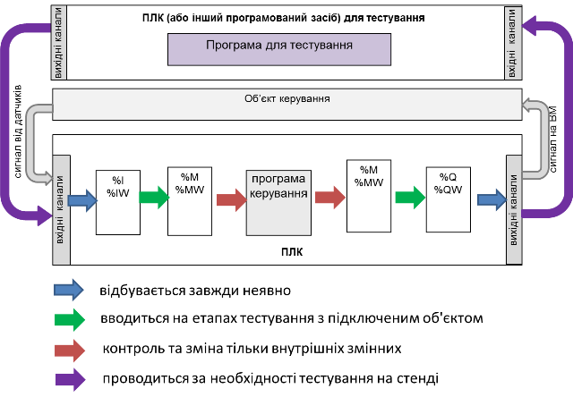
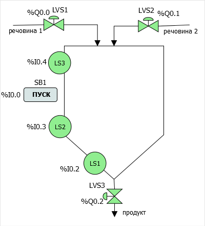
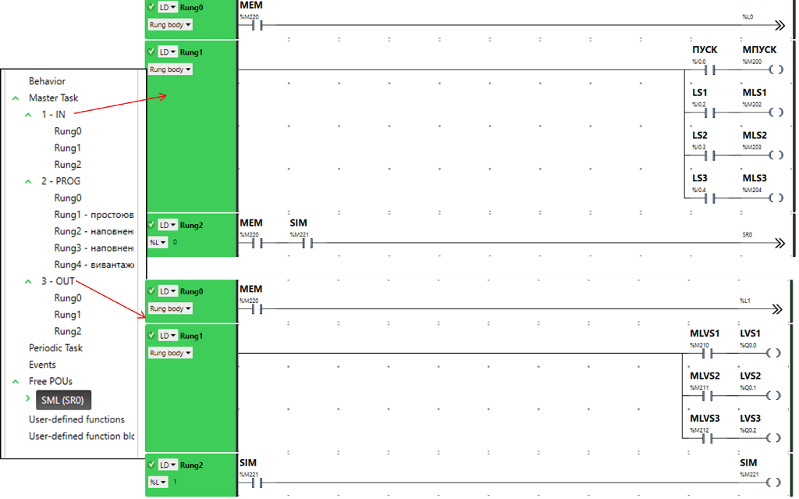

| [<- до лекцій](README.md)                          | [на основну сторінку курсу](../README.md) |
| -------------------------------------------------- | ----------------------------------------- |
| [<- Стано-орієнтоване програмування](statebase.md) | [Мова Grafcet->](6_SFC.md)                |

# Методики та засоби перевірки програм

Перевірка програм - це один із процесів, який проходить в життєвому циклі систем керування. На різних етапах ЖЦ можуть використовуватися різні способи, тому для початку коротко розберемо, які стадії та процеси проходять під час розробки системи керування.       

## Життєвий цикл систем керування та ПЗ

Під ***системою*** (system) - розуміється комбінація взаємодіючих елементів, організованих для досягнення однієї або декількох поставлених цілей. ПЛК варто розглядати як систему програмованого керування, яка є частиною системи керування технологічним процесом АСКТП (або машини). У свою чергу система керування є частиною технологічного комплексу, куди також входить технологічний об'єкт. У такому випадку, що розглядати в якості системи: технологічний комплекс, АСКТП, ПЛК, чи може окрему програму в ПЛК? Все це можна вважати системою, але що саме розглядається в конкретному випадку треба уточнювати. Систему, яку розглядають в конкретний момент часу прийнято називати ***цільовою системою***. 

***Життєвий цикл системи*** (***ЖЦ***, life cycle) – це розвиток системи від задумки до списання. Життєвий цикл (ЖЦ) систем, у тому числі програмних, включає в себе усі стадії - від виникнення потреби в системі певного цільового призначення до повного завершення її використання, у зв’язку з моральним старінням або за втрати необхідності. 

При розробці системи керування на певному відрізку часу приймають участь різні розробники. Так, наприклад програміст ПЛК приймає участь тільки на певному відрізку часу ЖЦ системи керування. Тому для нього роботи по просуванню цільової системи по життєвому циклу можуть початися пізніше і закінчитися раніше, ніж це відбувається в її життєвому циклі. Він розглядає цю частину робіт і часу, як ***проект***, для якого виділяються ресурси, та час відповідно до вимог. Цей проект також описується в термінах життєвого циклу. Тому слід розуміти що життєвий цикл проекту та цільової системи - це різні життєві цикли, але взаємопов'язані між собою. Так, наприклад, розробка програмного забезпечення може цілком бути проектом, якщо там не передбачаються роботи по супроводженню та виведення з експлуатації.   

Життєвий цикл традиційно ділять на ***стадії***, кожна з яких розглядається як роботи над системою (наприклад ПЗ) , що приводять до зміни її стану. За результатами цих робіт з’являються якісь артефакти (документи, програми, системні компоненти тощо) і приймають якісь важливі рішення щодо інших стадій. Стадії відрізняються за характером робіт. Наприклад, стадія "проектування" зосереджена на розробці певного типу документації, за яким проводять реалізацію, а "введення в дію" - на самій реалізації. Поділ життєвого циклу системи на стадії залежить від її типу та прийнятих правилах в тих організаціях, що її розроблюють. У якості прикладу, життєвий цикл будь-якої системи можна розглядати як наступні стадії: 

- задум: формування основних вимог до системи; вигляд системи - технічні вимоги, технічне завдання, опис прототипу;
- проектування: розробка необхідної для реалізації системи документації; вигляд системи - проектна документація;
- розроблення і тестування: створення системи в її кінцевому вигляді з тестуванням; 
- введення в дію: впровадження реалізованої системи у її робочому середовищі, перевірка на відповідність до замовлення;
- експлуатація (включаючи підтримку): супроводження, внесення змін в систему; 
- утилізація (виведення з експлуатації): роботи по знищенню системи.

Керування ЖЦ в часі може відбуватися за різними методиками, у залежності від вибраної моделі життєвого циклу. Наприклад, на рисунку 1 показана так звана V-модель.  

Рис.1. Приклад V-моделі життєвого циклу для програм в системах керування. 

Наприклад, якщо необхідно розробити систему керування, то ЖЦ буде складатися з таких стадій:

**Задум**. спочатку обдумують якою вона повинна бути і формують певний набір функціональних та інших вимог. Наводять перелік того, як повинна функціонувати система. Зокрема там буде фігурувати перелік функцій та задач, аналогічно тим, як це було наведено на попередній лекції, щодо приготування суміші. 

**Проектування**. Потім за цими вимогами роблять якісь схеми та описи, розділяють роботу на невеликі частини. Частина з цих робіт піде на розробку принципових схем, де до ПЛК будуть підключатися датчики, ВМ та перетворювачі. Будуть розроблені алгоритми, діаграми, які будуть описувати логіку роботи більш детально. Стадія проектування може бути розбита на ескізне (технічне) та деталізоване (робоче) проектування. При технічному проектуванні розробляють документацію, достатню щоб зробити замовлення на постачання компонентів (наприклад датчиків, ВМ, ПЛК і т.п). При робочому проектуванні роблять документацію необхідну для монтажу системи та введення в дію. При проектуванні ПЗ, можуть спочатку розбивати програму на компоненти (декомпозиція), а потім робити проект для компонентів.     

**Розроблення і тестування.** Далі ряд робіт підуть на розроблення ПЗ для ПЛК, інші, зокрема, на розробку щитів. Вже на цій стадії необхідна перевірка (тестування). ПЗ необхідно перевіряти на відповідність його виконання вказаним вимогам (алгоритмам). Можуть розроблятися спеціальні процедури для тестування як компонентів так і всієї сисмтеми. Зібрані щити (у тому числі з ПЛК) перевіряють на правильність підключення, після чого підключають живлення і перевіряють працездатність. Усі ці етапи, як правило проводяться на території розробника системи керування, а не на виробничому майданчику.   Інколи на майданчику розробника проводять інтегральне випробування , під час яких перевіряється робота системи або її частини в комплексі, тобто ПЗ+ПЛК+датчики/ВМ. Така перевірка називається верифікацією.         

**Введення в дію**. Після завершення усіх робіт по розробленню ПЗ та щитів, вони постачаються на виробничий майданчик (завод). Там проводять роботи по монтажу датчиків та ВМ, їх підключенню до щитів. Після цих етапів проводять тестові випробування. Ці випробування можуть відбуватися паралельно з монтажними роботами для інших частин системи. Вони проводяться, як правило, з використанням робочого ПЗ для ПЛК. Введення в дію це дуже трудоємка і вартісна стадія ЖЦ. Тому розробнику ПЗ для ПЛК варто передбачати додаткові можливості, розроблені саме для цієї стадії. Після усіх етапів тестування проводиться пуско-налагодження, яке передбачає перехід в робочий режим системи.  

**Експлуатація**. Під час стадії експлуатації, яка триває до кінця ЖЦ системи, потребується її обслуговування та модернізації. Модернізація передбачає введення або заміну функцій, алгоритмів роботи, добавлення нових контурів і т.п. Кожна зміна ПЗ потребує перевірку її функціональності, тобто тестування.    

**Утилізація**. Слід відмітити, що часто розробники систем останню стадію не враховують, вважаючи що після введення в дію та гарантійного терміну експлуатації інше лежить на плечах кінцевого замовника. 

Стадії як правило йдуть послідовно в часі, хоч можуть перекриватися. У сучасних методологіях розробки ПЗ поділ на стадії є досить умовним, і відноситься більше не до часу проведення робіт, а характеру діяльностей, які там виконуються. Послідовність стадій та процесів залежить від обраної моделі життєвого циклу. 

Підводячи підсумки, можна сказати, що перевірка працездатності програми проводиться на різних стадіях ЖЦ системи, принаймні на:

- розроблення і тестування: 
  - перевірка роботи компонентів ПЗ, навіть без наявного ПЛК;
  - перевірка всього ПЗ, навіть без наявного ПЛК;
  - комплексна (інтегральна) перевірка з ПЛК та підключеними пристроями (усіма або частково);
- введення в дію: комплексна (інтегральна) перевірка з ПЛК, підключеними пристроями системи, об'єктом керування, іншими суміжними системами;
- експлуатація:  перевірка нових функцій/алгоритмів.     

На кожній із стадій можуть використовуватися різні методики, як окремо, так і в комплексі.

## Засоби для тестування

Перевірка (тестування) ПЗ це по суті перевірка відповідності до вказаних у вимогах значень виходів ПЛК, інших змінних та його поведінки від стану входів (у тому числі з інших підсистем) та попереднього стану. 

При перевірці правильності роботи ПЗ для ПЛК використовують різноманітні засоби як самого середовища розробки, так і сторонні. Від наявності та доступності цих засобів можуть відрізнятися і методики перевірки.

### Засоби середовища розробки

#### Таблиці анімацій.

Серед засобів середовища розробки повинні бути наявні механізми перегляду змінних та їх зміни. У Machine Expert Basic це називається ***таблицею анімації*** (Animation Table). Таблиця анімацій дає можливість:

- добавляти будь які змінні для можливості перегляду значення в режимі підключення до ПЛК;
- змінювати значення змінних;
- форсувати значення змінних  

В режимі онлайн, Machine Expert Basic дозволяє змінювати значення деяких типів об'єктів. Зміна в режимі онлайн можлива лише в тому випадку, якщо об'єкт має доступ до читання/запису.  Наприклад:

- Значення аналогового вводу не може бути змінено;
- Можна оновити значення параметра Preset (об'єкт %TM0.P) функціонального блоку таймера.

Щоб змінити значення об'єкта, він добавляється до таблиці анімації, та встановлюється його властивості в міру необхідності.

рис.2.

#### Форсування

Під ***форсуванням*** розуміється примусова зміна значення будь яких змінних, у тому числі вхідних, незалежно від їх зміни в програмі користувача чи в апаратній частині. Ця функція використовується для налагодження. Якщо якась змінна знаходиться в режимі форсування, середовище а інколи ПЛК підсвічує індикатор стану форсування, щоб розробник не забув зняти форсування. 

У Machine Expert Basic існує кілька способів форсування значення логічних об'єктів у режимі онлайн:

- Використовуючи таблицю анімації;
- безпосередньо в редакторі (наприклад LD).

рис.3

Дискретні входи та виходи не можна форсувати, якщо:

- Вхід використовується як перемикач для START/STOP контролера;
- Налаштовано як швидкі вхідні лічильники (FC), високошвидкісний лічильник (HSC), або як швидкі виходи.

#### Засоби редакторів програм.

Редактори програм можуть також надавати можливості щодо налагодження. Зокрема, в Machine Expert Basic, редактор LD підсвічує стан замкнутих контактів, показує значення числових змінних, стан компараторів і т.п. Редактор також надає можливості по зміні значення змінних та їх форсуванню.      

рис.4

#### Графічні екрани.

Альтернативою табличному вигляду, середовище може надавати графічні екрани для перевірки та зміни стану змінних. Це примітивний ЛМІ (людино-машинний інтерфейс), який призначено саме для налагодження. 

У середовищі Machine Expert Basic немає вбудованих графічних налагоджувальних екранів.

#### Трейсери (тренди).

Багато середовищ розробки надає можливість відображати значення аналогових змінних у вигляді графіків. У Machine Expert Basic  це робиться з використанням ***Trace Window***, який дозволяє відображати в графічному вигляді значення аналогових або дискретних змінних (до 12 годин безперервного запису). До Trace Window можна додати до 8 об'єктів. 

рис.5

Trace Window відображає окремі графіки для кожного типу даних, обраних для відстеження в анімації:

- Числові значення виводяться в Numerical trace. Усі вони мають однакову шкалу на графіку. Можна вибрати «Auto scale for values» для автоматично налаштовування вертикальної осі, або задати масштаб вручну. 
- Дискретні значення з'являються в області Logical trace. Кожне Дискретні значення простежується за шкалою 0 і 1.

Мінімальний час налаштування періоду оновлення для Trace Window становить 1 секунда Тому, наприклад, зміни значень логічних змінних між основними циклами завдань простежити неможливо.

Вибирається "Elapsed time" для початку відстеження з 00:00:00, або "Controller time", щоб використати час та дату логічного контролера як час початку відслідковування. `START`, `STOP` і`RESET` використовується відповідно для запуску, зупинки стеження і очищення історії. Можна експортувати дані у файл CSV для подальшого аналізу.

#### Підсистема імітації (емуляції) ПЛК.

Великою перевагою для розробника є наявність підсистеми емуляції ПЛК. Це дає можливість перевіряти роботу програми ПЛК без його самого. Сучасні середовища розробки ПЛК різних фірм надають такі можливості, Machine Expert Basic - не виняток. 

Machine Expert Basic емулятор ПЛК надає наступні можливості:

- виконання логіки роботи програми
- перегляд та зміна значень входів/виходів ПЛК
- керування часом виконання
- підключення інших засобів до емулятора по протоколу Modbus TCP/IP (наприклад SCADA/HMI)  

рис.6.   

Тим не менше, у Machine Expert Basic емулятор має певні обмеження пов'язані з виконанням апаратних функцій, наприклад комунікаційних, PID-регулювання, підтримки системних бітів і т.п.  

#### Індикатори ПЛК

Індикатори ПЛК та вбудовані панелі дають можливість швидко дізнатися про стан ПЛК та його входів/виходів. Вбудовані панелі можуть надавати можливість перевірки та зміни значення змінних.    

### Сторонні засоби.

Для перевірки працездатності програми в ПЛК або в імітаторі можуть використовуватися сторонні засоби. Зокрема (але не виключно):

- мультиметри, для вимірювання стану входів/виходів ПЛК, та ланцюгів
- задавачі, для формування сигналу напруги/струму входів
- тестові комунікаційні утиліти, для налагодження комунікаційного зв'язку
- програмні імітатори (наприклад Simulink)

## Методики тестування

Як вже зазначалося вище, методики тестування вибираються як в залежності від доступних засобів, так і від стадії ЖЦ, де необхідно провести тестування. 

Так, наприклад, на початкових етапах стадії розроблення, тестування ПЗ часто відбувається без наявних підключень датчиків та ВМ. Це значить, що за можливості можна використовувати емулятори ПЛК та імітаційні програми, які допомагають перевірити правильність роботи логіки програми керування. 

На етапах комплексних випробувань основна логіка програми керування вже повинна бути налагоджена. Але деякі функції, наприклад комунікаційний обмін, додаткова обробка вхідних та вихідних сигналів перевіряються і виправляються саме на цих етапах та на стадії введенні в дію. Тут програма перевіряється на ПЛК у поєднанні з іншими пристроями та підсистемами. Тому емулятор ПЛК та програми імітування для цих типів тестування не використовуються. Те саме стосується стадії експлуатації. 

### Перевірка правильності роботи

У загальному випадку перевірка правильності роботи програми зводиться до перевірки зміни значення виходів та інших змінних від стану входів (у тому числі комунікаційних змінних). Для того щоб це зробити необхідно вирішити ряд наступних питань.

По-перше, повинна бути розроблена послідовність і правила перевірки. Для офіційного тестування (верифікації та валідації) як правило користуються офіційними документами - ***процедурами випробування***, які узгоджується та затверджується із замовником. Процедури випробування вказує на послідовність перевірки та очікувані результати. Саме за цим документом затверджується завершення певних стадій (див рис.1). Однак цей формальний документ не завжди зручний для рутинної перевірки програмістом ПЛК. Для самостійної перевірки це може бути документ будь якої форми. У багатьох випадках розробники взагалі не розробляють таких документів, а тримають алгоритм перевірки в голові, хоч це не є хорошою практикою. 

По-друге, треба передбачити те, яким чином відбуватиметься зміна вхідних значень. Враховуючи, що значення вхідних змінних ПЛК залежать від стану фізичних входів, на ранніх етапах це може бути проблематичним і займати багато часу. Така перевірка потребується лише на стадії введення в дію, або для невеликих ПЛК з нескладними алгоритмами керування. Уявіть собі що у вас кілька десятків входів і на кожній ітерації перевірки програми вам необхідно змінювати їх значення. Для систем середньої та великої канальності, треба передбачати можливість зміни через внутрішні змінні.       

По-третє. Враховуючи що перевірка правильності роботи програми проходить ітаративно, сама перевірка займає більше часу ніж написання коду програми. Тому варто подумати про автоматизацію процесів перевірки.  

### Декомпозиція

Як вже зазначалося вище, перед розробкою програми користувача варто приділити час на відокремлення умовно-незалежних функцій та задач, які можна реалізувати як окремі програмні частини (модулі). Для малих ПЛК програма може реалізовувати всього лиш одну задачу, але як правило їх набагато більше. Завдання зі змішуванням, яке розглядалося на попередній лекції по суті описується однією задачею. Але воно є дуже спрощеним і в реальному житті потребує реалізації додаткових функцій, наприклад контроля відкриття клапанів. Якщо доповнити її контурами регулювання температури, програмою автоматичної мийки, то вже з'являється додаткова функція стабілізації і задача мийки, які умовно незалежні.  

Виділення незалежних функцій/задач (модулів) приводить до розробки методик перевірки для кожної з них окремо. Це значно спрощує перевірку, так як зменшує об'єми змінних, які приймають участь в перевірці. Тим не менше, враховуючи що ці задачі можуть бути зв'язані, додатково необхідно також розробляти і проводити комплексні тести.      

### Ручна перевірка з використанням таблиць

На попередніх лекціях наводилася методика ручної перевірки з використання перевірочних таблиць. Тобто для кожної задачі/функції наводиться таблиця залежностей виходів від входів. Програміст перед розробкою програми для функції/задачі складає таку таблицю, а після розробки - крок за кроком перевіряє її правильність. Такі таблиці по суті стають прототипом для загальних процедур випробувань. Або навпаки, з процедур випробувань дуже легко зробити такі таблиці.

Таб.1.

| №    | стан/зміна стану  системи  | ПУСК | SB2  | LS1  | LS2  | LS3  | LVS1 | LVS2 | LVS3 | Примітка        |
| ---- | -------------------------- | ---- | ---- | ---- | ---- | ---- | ---- | ---- | ---- | --------------- |
| 1    | Предпуск                   | 0    | -    | -    | -    | -    | 0    | 0    | 0    | початковий стан |
| 2    | Пуск                       | 1    | 0    | 0    | 0    | 0    | 1    | 0    | 0    |                 |
| 3    | Наповн. нижче рівня LS2    | 0    | 0    | 1    | 0    | 0    | 1    | 0    | 0    |                 |
|      | ...                        |      |      |      |      |      |      |      |      |                 |
| 9    | Ємність порожня при "СТОП" | 0    | 1    | 0    | 0    | 0    | 0    | 0    | 0    |                 |

### Ручна перевірка з використанням часових діаграм (циклограм)

Іншою формою постановки завдання і його перевірки є часові діаграми, або циклограми. По суті це ті ж таблиці, але в графічному представленні, які замість кроків показують час. Циклограми зручні там, де виконання задачі означується часом. Тестування програми зводиться до перевірки спрацювання конкретного ВМ на певному відрізку часу. 

 

рис.7.

### Використання проміжних змінних для входів/виходів

Вхідні та вихідні змінні ПЛК прив'язані до відповідних каналів, що дещо утруднює налагодження програм функцій/задач. По-перше, змінювати вхідні змінні можна тільки через зміну сигналів або через форсування, що унеможливлює їх програмну зміну для автоматизації перевірки. По-друге, під час початку розробки програми користувача, назначення входів/виходів ПЛК може бути невідомим. По-третє, під час налагодження, нерідко підключення входів/виходів змінюється. 

Тому для ПЛК великої та середньої канальності часто застосовують механізм проміжних змінних. Ідея заключається в тому, що в логіці роботи програми використовують тільки внутрішні змінні. Наприклад для ПЛК M221 це будуть змінні типу `%M` та `%MW` (див.рис.8). На ранніх  етапах, коли перевірка роботи ПЗ проводиться без урахування зв'язку з датчиками та ВМ, прив'язку до входів/виходів не проводять. Коли є потреба зв'язати внутрішні змінні з реальними вхідними/вихідними роблять просте переприсвоєння (на рис.8 показано зеленими стрілками):

- вхідні змінні на початку задачі ПЛК
- вихідні - в кінці  задачі ПЛК     

рис.8. 

Таким чином, при тестуванні без врахування підключення датчиків та ВМ, частину програми, яка виконує переприсвоєння зовнішніх змінних внутрішнім відключають. Проводять тестування, шляхом  зміни та контролю внутрішніх змінних. При комплексних випробуваннях і на стадії експлуатації, переприсвоєння задіюють. При цьому кроки перевірки будуть практично ті самі. Такий підхід дає ще одну додаткову функціональність - можливість програмного імітування вхідних сигналів.     

### Використання програмних імітаторів

До цих пір ми розглядали тестування як повністю ручну процедуру. Коли приходиться проводити постійну перевірку виявиться, що сама перевірка займає набагато більше часу, ніж внесення в програму змін. Автоматизувати цей процес можна шляхом імітування вхідних змінних процесу керування. 

Такий підхід як правило передбачає використання проміжних змінних, але схема рис.8 матиме додаткову підпрограму, яка призначена для імітування (див. рис.9)  

рис.9.

Імітування вхідних змінних є по суті імітуванням об'єкту керування. Щоб розробник ПЗ не змінював ці змінні самостійно, він розробляє програму, яка це робить автоматично, так само, як би це було на об'єкті. Такий програмний імітатор можна задіяти при необхідності. Наприклад, у наведеній у попередній лекції задачі зі змішувачем, сигналізатори рівня можуть включатися і відключатися автоматично, коли ємність заповнюється або спорожнюються. При чому це відбуватиметься так, як і на реальному об'єкті. При цьому час можна пришвидшити за необхідності. 

Знову ж таки, перевірка з імітатором допомагає на стадії розробки та тестуванні. При введенні в дію робиться переприсвоєння до реальних входів/виходів, а імітатор відключається.

Для імітування можуть використовуватися різноманітні таймери, лічильники, барабанні регулятори, арифметичні операції та інше.   

### Використання програм та стендів для тестування

Використання імітатору наведеним вище способом може значно зменшити час розробки та налагодження, хоч потребує затрати часу на розробку імітатору. Це автоматизує процес налагодження, але робить це частково. Можна повністю автоматизувати процес тестування, але тоді необхідно розробити програму тестування, яка змінює значення одних змінних і контролює значення вихідних. 

На відміну від попереднього випадку така програма може зайняти велику частину ресурсів ПЛК. Тому часто розробляють не програму тестування, а стенд, в склад якого входить інший програмний засіб, наприклад ПЛК (див.рис.9). 

рис.10

Такі варіанти тестування можна використовувати для тиражованих систем, або функціонально-безпечних систем, де ціна помилки дуже дорога, а налагодження на майданчику дуже складне.

Наведені вище варіанти тестування можуть комбінуватися і не є вичерпними.  

## Приклад програми з імітатором

 Для прикладу розробки програми імітації візьмемо наведену в попередній лекції задачу, обєкт для якої показаний на рис.11.     

 рис.11. 

Для початку для вхідних та вихідних даних необхідно виділити проміжні змінні з наступним еквівалентом:

| Вхід/вихід змінна | Адреса I/O | Проміжна змінна | Адреса |
| ----------------- | ---------- | --------------- | ------ |
| ПУСК              | %I0.0      | MПУСК           | %M200  |
| LS1               | %I0.2      | MLS1            | %M202  |
| LS2               | %I0.3      | MLS2            | %M203  |
| LS3               | %I0.4      | MLS3            | %M204  |
| LVS1              | %Q0.0      | MLVS1           | %M210  |
| LVS2              | %Q0.1      | MLVS2           | %M211  |
| LVS3              | %Q0.2      | MLVS3           | %M212  |

Тепер Замість вхідних та вихідних змінних у програмі користувача можна використовувати проміжні змінні.

Варто добавити ще дві змінні, які будуть керувати підключенням реальних входів/виходів та імітатора.

- `MEM`(`%M220`) - коли `= 1`, тоді проміжні змінні не прив'язані до входів/виходів 
- `SIM` (`%M221`) - коли `= 1`, тоді проміжні змінні імітуються 

Тепер, для того щоб привести програму користувача до вигляду, як це показано на схемі з рис.9 необхідно добавити:

- один POU, який буде робити переприсвоєння входів перед виконанням програми керування, 
- один POU, що буде займатися виходами, - після. 

Також добавляється один POU - підпрограма для імітації, яка явно викликається з першої POU (див.рис.12). 

рис.12

Таким чином, програма користувача має 4 POU (рис.12):

- `IN` для переприсвоєння внутрішнім змінним значення входів;
- `PROG` - програма керування, аналогічна як в попередній лекції, але з використанням проміжних змінних; 
- `OUT` - для переприсвоєння виходам значення внутрішніх змінних;
- `SML` (SR0) - підпрограма, яка робить імітування вхідних проміжних змінних

Розглянемо кожен з POU детальніше. 

У `IN` спочатку перевіряється значення `MEM`: якщо режим MEM (без використання реальних входів та виходів) - перейти до Rung2 (за міткою `%L0`). Це, у свою чергу, значить, що Rung1, в якому проводиться переприсвоєння не буде виконуватися. У Rung2 робиться перевірка на  одночасність режимів `без реальних взходів/виходів` та `імітації`: якщо умова справджується - викликається підпрограма, яка імітує роботу вхідних проміжних змінних.

У POU `PROG` записана програма керуванння одним із способів, які були розглянуті в попередній лекції. Однак замість `%I` і `%Q` використовуються проміжні змінні `%M`. Зауважте, що реалізація програми з використанням фронтів працювати не буде.

У POU `OUT` у режимі `MEM=0` проводиться запис вихідним змінним значення проміжних. RUNG2 по суті нічого не робить (подумайте самі, що значить такий запис). Наявність подібного коду зумовлена  особливістю реалізації LD в M221: Rung не може бути порожнім, якщо він існує. Тут RUNG2 потрібен тільки для того, щоб на нього переходити за міткою `%L1`. Виглядає не дуже гарно, але інколи програмісту ПЛК приходиться виходити з різних ситуацій з не дуже гарними але робочими рішеннями :) 

У POU `SML`, яка є підпрограмою SR0, реалізована наступна програма (рис.13). 

 

 рис.13

У даному випадку для імітації рівня використано лічильник. Лічильник скидується на першому циклі після старту. Уставка лічильника дорівнює 6 - це умовний максимальний рівень. Кожну секунду (системний біт `%S6` - секундний меандр), у випадку відкриття одного з клапанів набору, плинне значення лічильника буде збільшуватися (вхід `CU` ). У випадку відкриття клапану зливу (`MLVS3`) плинне значення лічильника буде зменшуватися. Для того щоб лічильник не переходив вище через уставку і  нижче 0, поставлені додаткові умови по 'І' відповідно з перевіркою виходів лічильника `D` та `E`. Таким чином, після запуску набору лічильник дійде до уставки через 6 секунд. 

У задачі нам необхідно імітувати не сам рівень, а сигналізатори. Проміжна змінна сигналізатору верхнього рівня прив'язана до виходу `D` лічильника. Це значить, що коли лічильник дійде до уставки, ця змінна буде в `1`. Змінна сигналізатору нижнього та середнього рівня залежить від результатів компараторів порівняння плинного значення лічильника з різними значеннями: відповідно `>0` (не пустий) та `>=3` (вище середини).     

Це не єдиний спосіб імітування рівня. Можна використовувати, наприклад, оператори з інкрементом, або таймери. Програміст ПЛК завжди вибирає сам який спосіб йому найбільш підходить, і який найбільш відповідає поставленій задачі імітації. Так, наприклад в реальній установці при відкритті обидвох клапанів набору, набір буде відбуватися швидше, а у випадку наведеної вище імітації через лічильник - ні. Однак задумайтесь, чи для даного випадку тестування це принципово?  

Слід також черговий раз відмітити: не використовуючи проміжні змінні, наведений вище спосіб імітації зробити неможливо, оскільки у вхідні змінні записувати нічого неможна.     

Лектори - Олександр Пупена, Ігор Володимирович Ельперін. [АКТСУ НУХТ](http://www.iasu-nuft.pp.ua)      

| [<- до лекцій](README.md)                          | [на основну сторінку курсу](../README.md) |
| -------------------------------------------------- | ----------------------------------------- |
| [<- Стано-орієнтоване програмування](statebase.md) | [Мова Grafcet->](6_SFC.md)                |

