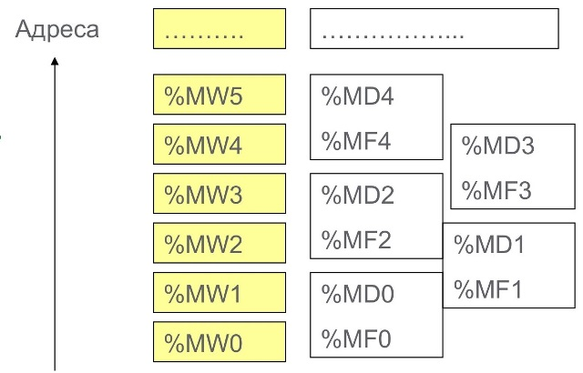
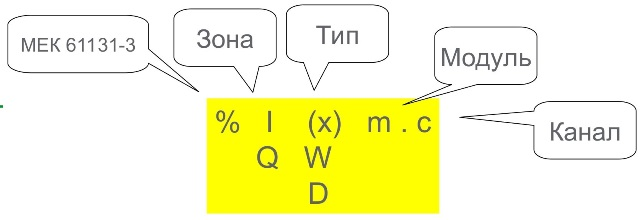
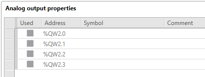
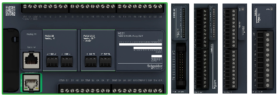
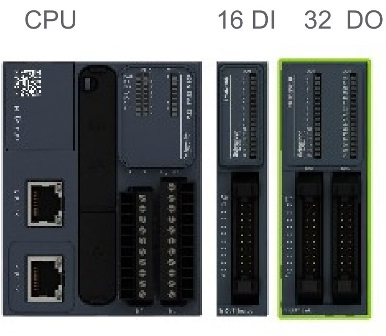
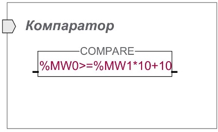
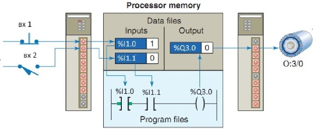

# ПРОГРАМНА СТРУКТУРА ПЛК

## Пам'ять ПЛК

- Оперативна пам'ять (RAM) - зберігає програму користувача і дані, не зберігається при втраті живлення.
- Постійна пам'ять (ROM, EPROM, Flash) - зберігає прошивку, програму користувача, дані та інше, зберігається при втраті живлення.
- М221 містить 512 Kb RAM, 1,5 Mb Flash. Пам'ять може бути додатково розширена картою SD.

## Змінні ПЛК

**Memory objects (M)** - Внутрішня пам'ять - використовується для зберігання призначених для користувача даних;

**System objects (S)** - Системна пам'ять - використовується для діагностики;

**I/O objects (I, Q)** - Відображення даних процесу з вхідних і та вихідних модулів;

**Software objects** - Зберігає в собі дані програмних об'єктів (таймерів, лічильників і т.д.).

У розділі Tools  вкладки Programing відображаються всі доступні змінні контролера у відповідності до його конфігурації.

### **Memory objects (M)**

Memory bits - біти внутрішньої пам'яті, можуть приймати значення TRUE або FALSE. Всього доступно 512 бітів з адресами %M0 - %M511.

Memory words - слова внутрішньої пам'яті, приймають цілочисельні значення зі знаком. Всього доступно 2000 слів з адресами %MW0 - %MW1999. 

В середовищі EcoStruxure Machine Expert - Basic доступна побітна адресація до слова. Оскільки одне слово містить 16 біт, для %MW0 можлива адресація від %MW0:Х0 до %MW0:Х15. для інших слів адресація аналогічна.

В свою чергу можна звертатись не до слова, а до подвійного слова, також  цілочисельних зі знаком. В такому випадку адреса може бути в діапазоні %MD0 - %MD1998. Варто враховувати, що це все одна область пам'яті, а отже звертаючись до %MD0 ви задієте слова %MW0 і %MW1, %MD1 - %MW1 і %MW2 і т.д.

При необхідності використання значень з плаваючою комою використовуються %MF0 - %MF1998. Аналогічно до %MD, %MF займає два слова, відповідно %MF0 займає слова %MW0 і %MW1.

Constant words - слова константи. Вони подібні до слів внутрішньої пам'яті, проте не можуть змінюватись з програми користувача. Доступно 512 слів в діапазоні від %KW0 - %KW511. Можливе використання %KD і %KF, побітна адресація відсутня.

### **System objects (S)**

System bits - системні біти, визначені виробником. По замовченню вони одразу мають символьну назву і коментарі. В залежності від призначення, системні біти можуть бути доступними для зміни з програми користувача або ні. Діапазон адрес %S0-%S159.

В таблиці нижче наведені деякі системні біти з описом, для ознайомлення з рештою, продивіться HELP.

| System word                 | Функція                                                      | Опис                                                         |
| --------------------------- | ------------------------------------------------------------ | ------------------------------------------------------------ |
| %S0                         | Cold Start                                                   | Виставляється в "1" при холодному старті контролера (з втратою даних) на один цикл. Скидається в "0" автоматично. |
| %S1                         | Warm Start                                                   | Виставляється в "1" при теплому старті контролера (зі збереженням даних) на один цикл. Скидається в "0" автоматично. |
| %S4 %S5 %S6 %S7 | Time base: 10 ms Time base: 100 ms Time base: 1 s Time base: 1 min | Бітові міандри, що вимірюються внутрішнім годинником, не синхронізуються з циклом контролера. Наприклад: %S4 буде 5 ms в стані "1", наступні 5 ms в стані "0". |
| %S10                        | I/O communication status                                     | Виставляється в "0" при наявності помилок обміну I/O. Якщо %S10=0, миготить ERR LED. |
| %S11                        | Watchdog overflow                                            | Виставляється в "1", якщо час циклу контролера перевищив час сторожового таймера. При цьому контролер переходить в стан HALTED. |
| %S12                        | Logic controller in RUNNING state                            | Показує чи контролер в стані RUNNING. Якщо %S12=1 - стан RUNNING, %S12=0 - STOPPED, BOOTING чи любий інший стан. |
| %S13                        | First cycle in RUNNING                                       | Виставляється системою в "1" на перший цикл після переведення контролера в стан RUNNING |
| %S36                        | Ethernet speed                                               | Визначає швидкість Ethernet. При %S36 = 1 швидкість 100 Mbps, при %S36 = 0 - 10 Mbps. |

System words - системні слова. Діапазон %SW0-%SW233. За допомогою системних слів можна відстежувати стан контролера, максимальний час сторожового таймера та інше. 

В таблиці нижче наведені деякі системні слова з описом, для ознайомлення з рештою, продивіться HELP.

| System word                                   | Функція                       | Опис                                                         |
| --------------------------------------------- | ----------------------------- | ------------------------------------------------------------ |
| %SW0                                          | Controller scan period        | Дозволяє змінити період сканування періодичної задачі в межах  (1...150 ms) |
| %SW1                                          | Periodic task period          | Дозволяє змінити час циклу періодичної задачі в межах  [1...255 ms] |
| %SW6                                          | Controller state              | Стан контролера: 0 = EMPTY 2 = STOPPED 3 = RUNNING 4 = HALTED 5 = POWERLESS |
| %SW7                                          | Controller status             | Містить запаковані біти статусу контролера, наприклад:  Bit [1]: Виставляється в "1", якщо конфігурація контролера в порядку  Bit [2]: Виставляється в "1", якщо вставлена SD картка  Bit [3]: Виставляється в "1", якщо SD картка доступна (статус картки)  Bit [5]: Виставляється в "1", якщо є помилка SD картки (статус картки)  Bit [7]: Виставляється в "1", якщо контролер підключений до EcoStruxure Machine Expert - Basic  |
| %SW11                                         | Software watchdog value       | Містить максимальне значення сторожового таймера, заданого в конфігурації (10...500 ms). |
| %SW18- %SW19                                  | 100 ms absolute timer counter | Подвійне слово (%SW18-%SW19), що збільшується від 0 до 2^31кожні100 ms. Скидається при реініціалізації і холодному старті. |
| %SW30                                         | Last scan time                | Показує час останнього циклу контролера (в ms).              |
| %SW49 %SW50 %SW51 %SW52 %SW53 | Real-Time Clock (RTC)         | RTC функція: слова містять поточний час і дату в форматі BCD. |

Input channel status - слово статуса аналогового входу. Генеруються автоматично у відповідності до конфігурації контролера. Звернення до слова у вигляді %IWSi.j, де i- номер модуля, j - номер каналу.

Output channel status - слово статуса аналогового виходу. Генеруються автоматично у відповідності до конфігурації контролера. Звернення до слова у вигляді %QWSi.j, де i- номер модуля, j - номер каналу.

### **I/O objects (I, Q)** 

Адресація залежить від розміщення модуля в конфігурації контролера.

Digital inputs - дискретні входи. Звернення до слова у вигляді %Ii.j, де i- номер модуля, j - номер каналу.

Digital outputs - дискретні виходи. Звернення до слова у вигляді %Qi.j, де i- номер модуля, j - номер каналу.

Analog inputs - аналогові входи. Звернення до слова у вигляді %IWi.j, де i- номер модуля, j - номер каналу.

Analog outputs - аналогові виходи. Звернення до слова у вигляді %QWi.j, де i- номер модуля, j - номер каналу.

Fast counter - швидкі лічильники для підключення енкодерів,  можуть застосовуватись лише з деякими дискретними каналами. Звернення у вигляді %FC0.

Для прикладу розглянемо адресацію змінних ПЛК з наступною конфігурацією:

- Контролер TM221CE40R (24 дискретні входи, 16 дискретних виходів, 2 аналогові входи)

- Картридж розширення TMC2AI2 (2 аналогові входи)

- Картридж розширення TMC2AQ2C (2 аналогові виходи)

- Модуль дискретних входів TM3DI16K (16 дискретних входів)

- Модуль дискретних виходів TM3DQ16R/G (16 дискретних виходів)

- Модуль аналогових входів TM3AI4/G (4 аналогові входи)

- Модуль аналогових виходів TM3AQ4/G (4 аналогові виходи)

  

Номер процесорного модуля завжди 0. Отже входи/виходи, розміщенні на TM221CE40R матимуть наступні адреси:

- Дискретні входи - %I0.0 - %I0.23
- Дискретні виходи - %Q0.0 - %Q0.15
- Аналогові входи - %IW0.0 - %IW0.1

Оскільки картриджи також монтуються на процесорний модуль, номер модуля буде 0. Проте адресація каналів для першого картриджу починається зі 100, для другого - з 200. Відповідно отримуємо наступні адреси:

- TMC2AI2 - %IW0.100 - %IW0.101
- TMC2AQ2C - %QW0.200 - %QW0.201

Номера наступних модулів залежать від їх фізичного розміщення. Одразу після процесорного модуля йде модуль номер 1, потім 2 і т.д. Відповідно адреси будуть такі:

- TM3DI16K - %I1.0 - %I1.15 
- TM3DQ16R/G - %Q2.0 - %Q2.15
- TM3AI4/G - %IW3.0 - %W3.3
- TM3AQ4/G - %QW4.0 - %QW4.3

### Software objects**

Сюди відносяться таймери, лічильники та інші об'єкти, які будуть розглянуті пізніше.

## Апаратна конфігурація ПЛК

Процес апаратного конфігурації - важливий початковий етап програмування ПЛК. Його суть - резервування області пам'яті CPU під конкретний модуль.

Стандартом IEC 61131 описано 5 мов програмування ПЛК:

1. Instruction list (IL) - текстова асемблер-подібна низькорівнева платформо-незалежна мова.
2. Ladder diagram (LD) - графічна мова, програмна реалізація релейно-контактних схем.
3. Function block diagram (FBD) - графічна мова, кожен блок відображає якусь підпрограму або операцію.
4. Sequential function chart (SFC) - графічна мова, представляє собою програмну реалізацію математичного апарату мереж Петрі.
5. Structured text (ST) - текстова паскале-подібна мова.

- контакти/компаратори не можуть розміщуватися в останній колонці;
- контакти/компаратори не можуть розміщуватися після (праворуч) котушок/операц. блоків.

